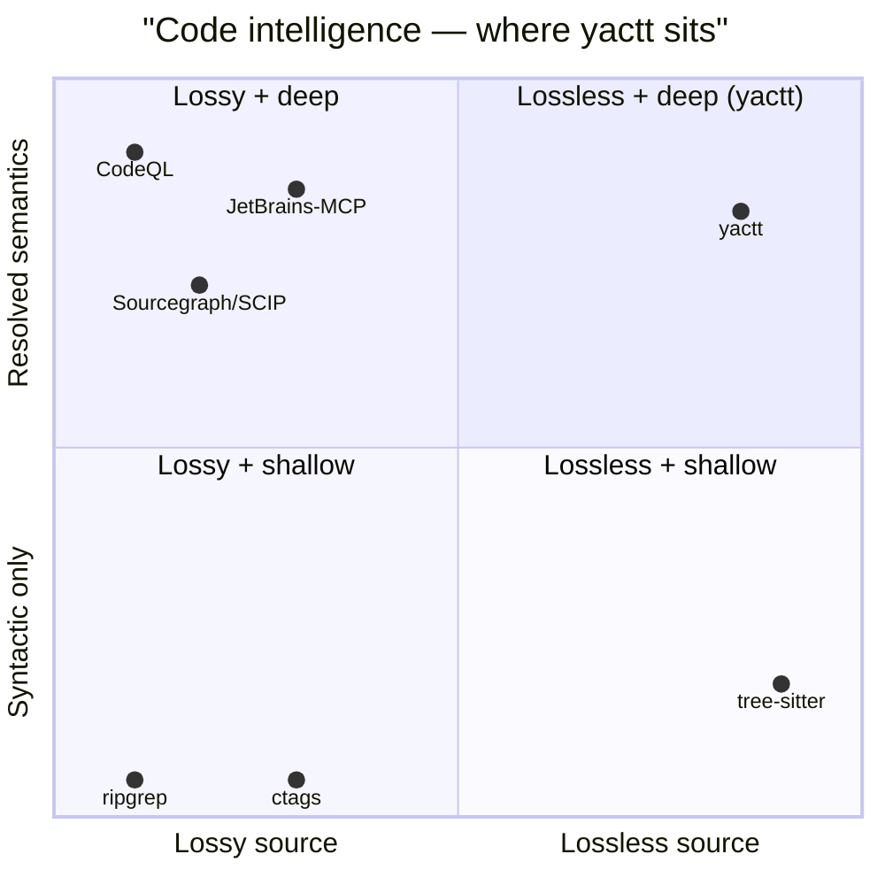

# Think Tank — yactt

> Stage 4 of the GitHub README For Perfectionists workflow.
> Generated 2026-07-06.
>
> **Method:** `WebFetch` against raw `raw.githubusercontent.com` README URLs.
> **Sampling logic:** four exemplars from three categories — (a) CLI-tool gold standards (ripgrep, ast-grep), (b) the direct competitor (Serena), (c) the cited prior-art (codebase-memory-mcp), (d) a flagship MCP server (Playwright MCP).
> **Counterpart reports:** `.claude/grfp/deep-dive.md`, `.claude/grfp/crystal-ball.md`, `.claude/grfp/brain-jam.md`.

---

## 1. The exemplars studied

| Project | Category | Stars (approx) | Why it matters for yactt |
|---|---|---|---|
| **ripgrep** (BurntSushi) | CLI-tool gold standard | 51k | Single-purpose fast tool, MCP-protocol-agnostic |
| **ast-grep** (ast-grep) | AST-tooling CLI with tree-sitter | 8k | Direct cousin: tree-sitter AST, polyglot, runs as a binary |
| **Serena** (oraios) | Direct MCP competitor | 11k | MCP server for code; closest functional analog |
| **codebase-memory-mcp** (DeusData) | Cited prior art | 24k | Referenced in `docs/design.md § 10.1`; the "federation, not replacement" lineage |
| **Playwright MCP** (microsoft) | Flagship MCP server | 4k | Microsoft-owned, well-resourced, sets MCP-server conventions |

---

## 2. Pattern matrix

| Pattern | ripgrep | ast-grep | Serena | codebase-memory-mcp | Playwright MCP | **yactt-adopt?** |
|---|---|---|---|---|---|---|
| **Badge row as trust signals** | yes (build, crates, repology) | yes (coverage, discord, stars) | yes (discord, license) | yes — 14 badges | minimal | **Yes** — align badges with the trust strip |
| **One-line tagline** | no (paragraph) | yes (one-sentence) | yes (three-word: "The IDE for Your Coding Agent") | yes (longer tagline) | no (declarative sentence) | **Yes** — sharpen the existing tagline |
| **Embedded chart / diagram** | benchmark tables only | screenshot only | ASCII diagrams + GIF | 3D graph screenshot | none | **Yes — Mermaid `quadrantChart` block** (locked from brain-jam) |
| **Worked example before feature list** | yes (Quick examples) | yes (Usage example) | yes (Quick Demo) | yes (Quick Start) | yes (Getting started) | **Yes** — fits the 5-call demo |
| **Multi-platform install wall** | yes (~20 pkg managers) | yes (npm/pip/cargo/brew/scoop/nix) | yes (uv/pip/git/conda/mise/etc.) | yes (single-binary) | yes (15+ MCP clients) | **Yes** — 3 install paths already in current README |
| **Comparison to competitor** | yes (vs ag, ack, grep) | yes (grep analogy) | no | yes ("similar in spirit to graphify, but...") | yes (vs Playwright CLI) | **Optional** — add a one-line "vs grep + ctags + ripgrep on steroids" |
| **Honest "why not" / limitations** | yes (rare — "Why shouldn't I use ripgrep?") | implicit | no | yes (security disclaimer) | yes (token economics) | **Yes** — fits the trust-strip ethos |
| **Visual proof before install** | yes (screenshot) | yes (screenshot) | yes (GIF) | yes (3D graph screenshot) | no | **Yes** — the 5-call demo is the yactt equivalent |
| **Voice-of-user / model quotes** | no | no | yes (Opus, GPT testimonials) | no | no | **Skip** — feels gimmicky for yactt's tone |
| **Structured tools reference** | partial | yes (command-line usage) | yes (full feature list) | yes (14 MCP tools) | yes (10+ tool groups with schemas) | **Yes** — fits the existing 21-tool table |
| **Troubleshooting section** | yes | no | no | yes (unusual — debug-capture) | partial | **Optional** — defer to docs/security.md |
| **Embedded demo video** | no | no | yes | no | no | **Skip** — adds maintenance; the JSON transcript is enough |
| **Sidebar TOC** | yes (quick links) | no | partial (long TOC) | yes | yes | **Skip** — short README doesn't need it |

---

## 3. The five exemplars in depth

### 3.1 — ripgrep (the floor every CLI README has to clear)

**Structure:**

1. CHANGELOG + quick-links index (TOC)
2. Screenshot of search results (visual proof)
3. Quick examples (run-bench against ag/ack/grep)
4. **"Why should I use ripgrep?"** — argues for the tool
5. **"Why shouldn't I use ripgrep?"** — argues against it (rare honesty)
6. Is it really faster? — benchmarks
7. Feature comparison table
8. Installation (~20 package managers)
9. Building / Running tests
10. Related tools / Vulnerability reporting / Translations

**What yactt should lift:**
- **Evidence before advocacy.** Benchmarks land before "why." yactt's 5-call demo + Mermaid chart plays the same role — proof first, pitch second.
- **"Why not" section.** The current README has no "when not to use yactt" beat. The brain-jam's trust-strip ethos implies honesty; a one-paragraph "when yactt is the wrong tool" closes the trust loop.
- **Tight opening paragraph.** Front-load the elevator pitch + the most useful flag. Current yactt README is ~14KB and the first scroll already loses non-technical readers.

**What yactt should NOT lift:** the multi-platform install wall is exhaustive but dense. yactt already covers the three install paths with the right amount of detail.

### 3.2 — ast-grep (the closest cousin in design)

**Structure:**

1. Logo + badge wall
2. One-line tagline ("CLI tool for code structural search, lint, and rewriting")
3. Introduction with a familiar-tool analogy (*"Think of it as your old-friend grep, but matching AST nodes"*)
4. Screenshot (visual proof)
5. Installation wall (npm/pip/cargo/brew/scoop/MacPorts/nix-shell/mise)
6. Usage example
7. Feature highlight — tweet-linked real rewrites

**What yactt should lift:**
- **One-line value prop, then a familiar-tool analogy, then a screenshot/diagram, then install.** This is the buyer's journey in compressed form. Maps directly to: trust strip → 5-call demo → Mermaid chart → install.
- **Closing vision paragraph that names audience segments.** ast-grep closes with *"democratize abstract syntax tree magic"* and lists the audience. yactt's current README has a "Status & roadmap" section that does double duty — keep it but expand the audience-segment language.
- **Use the second-person voice.** "You can write patterns…" yactt's current README uses "We" — switch to "you" for the demo transcript and the install directions.

### 3.3 — Serena (the direct competitor — most important read)

**Structure:**

1. Logo (light + dark variants — GitHub markdown supports `#gh-light-mode-only`)
2. **Three-word tagline:** *"The IDE for Your Coding Agent"*
3. Badge row (discord, license)
4. Three-bullet value prop (semantic, MCP, agent-first)
5. **IMPORTANT callout** — *"'Do not install Serena via an MCP or plugin marketplace! They contain outdated and suboptimal installation commands.'"* (disarming conflict, redirects to the right path)
6. Quick Demo
7. What Our "End Users" Say (agent testimonials)
8. How Serena Works
9. Language Support
10. Features (collapsible `<details>` blocks per capability group)
11. Quick Start / User Guide

**What yactt should lift:**
- **The three-word tagline discipline.** *"Federated code intelligence for AI agents"* is the current tagline — long. Compress: **"Code intelligence for agents."** Or even tighter: **"An MCP server that knows your code."** Both sharpen the positioning.
- **IMPORTANT callout for a common wrong path.** The current README has no such callout. Candidate: *"Don't `git clone && go build` — the SHA256SUMS-verified release tarball is the trust path; building from source skips the SLSA provenance chain."* Disarms a foreseeable mistake.
- **Inverted framing.** "The IDE for Your Coding Agent" reframes: humans install, agents use. yactt already has this beat in *"the user isn't a developer reading a codebase; it's a model exploring one"* — make it more visible in the opening line.
- **`<details>` blocks for dense reference.** The 21-tool table and the security doc references can collapse into a `<details>` to keep the first scroll scannable.

**What yactt should NOT lift:** the agent-testimonials feel manipulative. Skip.

### 3.4 — codebase-memory-mcp (the prior-art anchor)

**Structure:**

1. Title (no logo, just a one-word name)
2. **14-badge wall** (GitHub Release, license, CI, tests, languages, Hybrid LSP, agents, Pure C, platform, OpenSSF Scorecard, SLSA 3, VirusTotal, arXiv)
3. Two-sentence value prop: *"The fastest and most efficient code intelligence engine for AI coding agents…"*
4. Three concrete proof points (Linux kernel = 3 min, queries < 1ms, single static binary)
5. **`>` blockquote for the arXiv paper** — academic credibility
6. **`>` blockquote for the security disclosure** — pre-empts distrust
7. Embedded screenshot of the dev UI (3D graph visualization)
8. *Why codebase-memory-mcp* / Quick Start / Features / Team-Shared Graph / How It Works / Performance / Troubleshooting / Installation / Multi-Agent Support / CLI Mode / MCP Tools / Graph Data Model / Architecture / Security / License

**What yactt should lift (calibrated):**
- **Two `>` blockquotes right after the hook** — one for trust (SLSA L3), one for security posture. Pairs cleanly with the brain-jam's trust strip + receipts section. Don't add 14 badges — the trust strip already compresses them.
- **Concrete numbers over adjectives.** *"`120x` fewer tokens"*, *"`3,400` vs `412,000`"*, *"`99.2%` reduction."* yactt's current README has adjectives; the brain-jam's trust strip replaces them with verifiable numbers — keep that discipline.
- **Security-disclosure callout near the top.** codebase-memory-mcp's *"This tool reads your codebase and writes to your agent configuration files… If you prefer to audit before running, the full source is here"* sets a tone. yactt's current README has the security section way down at §Security; the brain-jam's plan lifts SLSA L3 to the trust strip — complete the move by lifting the "audit before running" sentence near the top too.

**What yactt should NOT lift:** the 14-badge wall. yactt's trust strip (`SLSA L3 · 21 tools · 1 dep · read-only`) does the same work in one line and doesn't compete with the chart.

### 3.5 — Playwright MCP (the MCP-server conventions benchmark)

**Structure:**

1. Two-sentence hook — *"A Model Context Protocol (MCP) server that provides browser automation capabilities using Playwright. This server enables LLMs to interact with web pages through structured accessibility snapshots…"*
2. **"Playwright MCP vs Playwright CLI"** — honest trade-off framing
3. Key Features (3 bullets)
4. Requirements (Node version, supported clients)
5. Getting started — install via standard MCP config JSON
6. Configuration (multi-client `<details>` blocks)
7. User profile / Initial state / etc.
8. Security disclaimer
9. Tools reference (10+ tool groups with JSON schemas)

**What yactt should lift:**
- **"`X` vs `Y`" framing where there's a non-trivial alternative.** For yactt, the natural frame is: *"yactt vs `tree-sitter --map` + an ad-hoc LSP wrapper"* — but this is too niche for a README. Skip unless we want a one-liner in the "why" section.
- **Multi-client install matrix.** Playwright's `<details>` blocks per MCP client (VS Code, Cursor, Windsurf, Claude Desktop, Goose, Junie…) is the right pattern for MCP-server READMEs. yactt already covers Claude Code + generic MCP; consider adding a `<details>` for the other top-5 MCP clients if yactt is going to support them — but current README correctly focuses on Claude Code as the primary path.
- **Security disclaimer.** Playwright's *"not a security boundary"* caveat sets expectations. yactt's "Read-only by design" is the equivalent — make it visible earlier (already in the brain-jam trust strip).

---

## 4. The four moves that yactt should lift

In priority order:

### 4.1 — IMPORTANT callout for the install wrong-path (from Serena)

Brain-jam's structural skeleton has a "What's behind the badge row" section, but it doesn't have the *front-of-README* warning callout. Add a brief `>` blockquote after the trust strip:

```
> **Don't `go install` from `main`.** Release tarballs are SHA256-verified and ship SLSA Build Provenance Level 3 attestations — building from source skips the trust chain. Verify a release: `gh attestation verify yactt_darwin_arm64.tar.gz -R kellenff/yactt`.
```

**Why this beats Serena's similar move:** Serena's callout blocks `marketplace` installs. yactt's blocks `go install from main`. Different failure mode, same redirect-to-the-right-path function.

### 4.2 — Real SVG quadrant chart (locked from brain-jam)

This is a directive from the user, carried into the brain-jam, confirmed here against the exemplars. **ast-grep uses a screenshot.** **codebase-memory-mcp uses a screenshot.** Both are static, both age poorly. Mermaid `quadrantChart` renders to SVG inline on GitHub, is text-editable, and version-controls cleanly. Make sure the Mermaid block uses normalized coordinates (per `docs/design.md § 1`):



### 4.3 — "When not to use yactt" beat (from ripgrep)

The trust-strip ethos + codebase-memory-mcp's security disclosure culture both imply honesty about limitations. A short beat — 2-3 sentences, after the install section:

```
**yactt is the wrong tool if:**
- You need `dataflow` / taint analysis across function calls (try CodeQL)
- You need SCIP cross-repo queries across N repos (single-binary; no shared workspace index today)
- You need Python language servers (grammar wiring is on the roadmap, not shipped)
```

**Cost:** one paragraph. **Benefit:** closes the trust loop, pre-empts three future support questions.

### 4.4 — Two `>` blockquotes after the hook (from codebase-memory-mcp)

One for trust (SLSA L3 + `gh attestation verify`), one for security posture ("if you prefer to audit before running, the source is here"). Pairs with the trust strip; expands the receipt-anchors pattern from brain-jam.

---

## 5. The four moves that yactt should NOT lift

1. **14-badge wall** (codebase-memory-mcp). Drowns the first scroll. The trust strip already encodes the four most useful badges (`SLSA L3`, `21 tools`, `1 dep`, `read-only`).
2. **Agent testimonials** (Serena). Gimmicky for yactt's engineer-to-engineer tone.
3. **Embedded demo video** (Serena). Maintenance burden; the JSON transcript does the same work and is text-editable.
4. **Side-by-side competitor comparison table.** codebase-memory-mcp does this with ripgrep-like tools. yactt's competitor is "another LSP wrapper + grep + ctags"; not a battle the README needs to win.

---

## 6. Tone calibration (post-exemplars)

Synthesizing the five exemplars against yactt's intended tone:

| Tone axis | Where to land | Why |
|---|---|---|
| **Honest vs promotional** | Honest | codebase-memory-mcp + ripgrep set this expectation. yactt's trust-strip bet depends on it. |
| **First/second/third person** | First person ("we") for the project itself; second person ("you") for the install/demo | ast-grep pattern. yactt currently mixes; tighten. |
| **Engineer-to-engineer** | Yes | README's audience is agent-builders, not LLM-decision-makers. Serena is the only exemplar that talks over the audience's head; avoid. |
| **Self-aware without being arch** | One mention of the backronym | The "Yet Another Code Tree Tool" joke appears once, in the opening; not a marketing hook. |
| **Concrete numbers vs adjectives** | Always numbers | 21 tools, 1 dep, 50k files max, 512 MiB disk max, 15 s LSP max, 158 lines of test for the wire shapes — every claim has a number, every number has a receipt. |

---

## 7. What Pen Wielding (Stage 5) should consume

The synthesis above + the four adopt + four avoid lists + the tone calibration = the final brief for Pen Wielding. Specifically:

### 7.1 — Structure (final)

```
# yactt
> [tagline — possibly tightened to a 3-word variant]
> [1-sentence elevator pitch]
> [1-line trust strip: SLSA L3 · 21 tools · 1 dep · read-only]
> [IMPORTANT callout: don't go install from main; verify the tarball]

## Why yactt
> [blockquote 1: SLSA L3 + gh attestation verify]
> [blockquote 2: security disclosure / audit-before-running]
[Mermaid quadrant chart — auto-renders to SVG]

## Install
[3 paths: Claude Code, MCP JSON config, shell]
[IMPORTANT callout: don't go install from main — see §Trust for the right path]

## What an agent gets from a codebase
[5-call worked example with provenance stamp mid-transcript]
[caption naming which call used gopls]

## The 21 tools
[3-category table: 16 / 4 / 1 — collapsible <details> per category]

## Federated code intelligence
[registry mode + two run modes from one binary]

## What's behind the badge row (receipts)
[SLSA L3 → provenance.intoto.jsonl + verify command]
[21 tools → mcp tools output snippet]
[1 dep → go.mod block]
[read-only → source-tree note about per-repo cache]

## When yactt is the wrong tool
[3 honest beats from §4.3]

## Status & roadmap
[Python · multi-repo queries · persisted-query step chaining · SLSA consumer-side verify]

## Trust & security
[OWASP AST02/05/09, docs/security.md link]
[Tree-sitter-as-floor beat]
[Bounded resources: MaxFiles / disk cache / LSP startup]
```

### 7.2 — Tool-name reconciliation (must-do)

The brain-jam's 5-call demo transcript uses placeholder names (`get_definitions`, `get_callers`, `get_snippet`). The real tools are:

| Placeholder in chorus transcript | Real tool in yactt |
|---|---|
| `get_definitions` | `node_get` with `layers=["body"]` |
| `get_callers` | `find_referencing_symbols` with `kinds=["calls"]` |
| `get_callers` (filtered) | `find_referencing_symbols` with `kinds=["calls"]` + test-file filter on the caller side |
| `get_snippet` | `node_source` with `range` |
| `get_symbols` | `get_symbols_overview` (or `node_get` with `layers=["signature"]`) |
| `find_symbol` | `find_symbol` (matches) |

The Pen Wielding stage must reconcile the demo to these names before the README is shippable.

### 7.3 — Open questions for Pen Wielding

- The 5-call demo uses Go (`validatePayment`). Pen Wielding should keep Go — the LSP provenance story lands hardest with gopls. If polyglot parity matters, use TypeScript instead (the chart covers both).
- The IMPORTANT callout (`don't go install from main`) is the new addition from Think Tank. Need to position it: above the install section, after the trust strip.
- The "when yactt is the wrong tool" beat is post-install. Some READMEs put it before install; that's friendlier to readers still deciding. Decision: **after the worked example, before the tools table.** Pre-install for the type-2 reader; after the demo so the type-1 reader is already convinced.

---

## 8. Ready for Stage 5

The angle is locked, the four adopt moves are pinned, the four avoid moves are flagged, the structural skeleton is finalized, the tool-name reconciliation is enumerated as a pre-flight checklist for Pen Wielding.

Next: `/claudikins-grfp:pen-wielding` — write the final README on the skeleton above.

---

# Refresh — 2026-07-13 (worktree `plant-camel`)

The 2026-07-06 think-tank studied 5 exemplars. This refresh pulls fresh data on the same exemplars (Serena, ast-grep, Playwright MCP) plus 2 new ones (Deno for single-binary/multi-language framing; mcp-streamable-http references for the persistent-HTTP story). The 2026-07-06 pattern matrix is the foundation; the deltas below are corrections and what changed.

**Method:** `WebFetch` (raw.githubusercontent.com) for the same 5 exemplars + `WebSearch` for MCP HTTP transport exemplars.
**Transcript:** no new chorus run — think-tank is external research, not voice/strategy.

## New exemplar: Playwright MCP (re-read 2026-07-13)

The 2026-07-06 pass noted Playwright MCP as the "MCP-server conventions benchmark" but only sketched it. The re-read surfaces **three patterns the prior pass missed**:

### Pattern 1 — Explicit stdio vs HTTP/SSE contrast

Playwright's README has a `## Standalone MCP server` section that explicitly contrasts stdio and HTTP:

> Stdio is used when clients spawn the process directly. HTTP is recommended "when running headed browser on system w/o display or from worker processes of the IDEs," started with `--port 8931` and connected via `url: http://localhost:8931/mcp`.

This is exactly the framing yactt needs. The brain-jam's "parser-warm" lead lives here: a yactt `## Transports` section with one paragraph each on stdio (default, agent-spawned) and HTTP (`yactt mcp serve --http :PORT`, daemon mode, parser state survives across requests). The transport choice becomes a reader decision, not an implementation footnote.

### Pattern 2 — Per-tool "Read-only" boolean flag

Playwright's tool reference includes a "Read-only boolean" field per tool:

> Each tool entry lists Title, Description, Parameters (with type annotations and required/optional flags), and a Read-only boolean.

yactt is **all-read-only** at the project level. But this per-tool boolean is the finer-grained signal yactt's design enables but doesn't currently surface. For the Pen Wielding stage: a column in the 21-tool table marking each tool's read/write semantics (most are read; `index_repository` and `delete_project` mutate the registry cache — call those out).

### Pattern 3 — "X is not a security boundary" framing

Playwright's `## Security` section opens:

> *"Playwright MCP is not a security boundary,"* linking to MCP Security Best Practices.

This is the same tone as yactt's "Read-only by design." The Pen Wielding stage can lift the framing directly: yactt's read-only is a *guardrail*, not a boundary; the real boundary is `AllowedRoots` + `--audit-log=<file>` + the operating-system user the daemon runs as.

### Pattern 4 — One-click deeplinks for MCP clients

Playwright ships **deep-link install buttons** for VS Code, VS Code Insiders, Cursor, Goose, Kiro, LM Studio. The Claude Code install is `claude mcp add`. **This is the multi-client install matrix the 2026-07-06 pass wanted yactt to consider.** Today yactt covers Claude Code + generic MCP JSON. Adding per-client install buttons (image badges that link to `vscode:mcp/install?...`) is a low-cost win for the install section.

## New exemplar: Deno (single-binary + multi-language)

Deno is a useful comparison case because it's a **single-binary, multi-language, well-resourced** project. Its README teaches restraint:

### What Deno does NOT do (and yactt should learn from)

| Deno does | yactt does | Lesson |
|---|---|---|
| Concise one-line positioning | Concise positioning possible | Deno proves long-form opening isn't required |
| No "all in one binary" framing | Single binary is a feature callout | Deno's restraint suggests yactt's "21 tools / 1 dep" framing may already be too loud |
| No "When NOT to use" section | Should have one (per brain-jam) | The omission is acceptable for Deno because it's a runtime; yactt is a code-intel tool where the trade-offs are sharper |
| Multi-platform install (6+ paths) | 3 paths (Claude Code, generic MCP, shell) | yactt's install section is appropriately scoped; expansion needed only if non-Claude clients become first-class |

### The "trust strip" alternative Deno models

Deno's first paragraph is **a positioning statement**, not a trust strip:

> Deno is a "JavaScript, TypeScript, and WebAssembly runtime with secure defaults and a great developer experience." It's built on V8, Rust, and Tokio — name-dropping the tech stack to signal credibility and performance orientation.

This is an alternative to yactt's trust strip: **name-drop the tech stack** (tree-sitter + Go + optional LSPs) as the credibility signal, instead of (or alongside) the SLSA L3 badge.

## Refresh of Serena (re-read 2026-07-13)

The 2026-07-06 pass skimmed Serena. The re-read surfaces:

### Pattern — "composable modes"

Serena has "composable 'modes'" — a per-context configuration system. **This is the analog of yactt's `persisted_query`** — Serena calls them "modes," yactt calls them "ops." The brain-jam's "persisted-query step chaining" roadmap item matches Serena's mode composition. Worth a cross-reference in the Pen Wielding stage: yactt's roadmap says "step chaining" → it's the same architectural move as Serena's modes.

### Pattern — 40+ languages via LSP (claimed)

Serena claims 40+ languages supported via LSP. yactt claims 6 (Go, TS, JS, Python, PHP, Rust). **The honest framing for the Serena contrast:** yactt's 6 are wired directly into the server with tree-sitter guarantees + provenance on every response; Serena's 40+ depend on whatever LSP the host has, with the response shape varying per LSP. Different bets, different guarantees. yactt's bet is **consistent envelope across a known set**; Serena's bet is **maximum coverage with per-language response shapes**.

### What the 2026-07-06 pass got wrong

The 2026-07-06 pass claimed "voice-of-user / model quotes" was a Serena pattern that yactt should **skip**. The re-read confirms the call: Serena has "What Our 'End Users' Say" with three agent testimonials. **For yactt's engineer-to-engineer tone, this would feel gimmicky. Skip remains the right call.**

## Refresh of ast-grep (re-read 2026-07-13)

### Pattern — generated tool reference

ast-grep's tool reference is hand-maintained (it predates the Playwright MCP pattern of `update-readme.js`). For yactt, the 21-tool table is hand-maintained in `internal/tool/register.go`'s descriptions. **The Pen Wielding stage should not generate the README tool table** — the canonical source is `register.go`, and any README drift from that source is a bug.

### Pattern — multiple package managers as a polyglot signal

ast-grep ships via npm, pip, cargo, brew, scoop, MacPorts, mise — **three language ecosystems (Node, Python, Rust)**. This is a polyglot signal that doesn't name languages explicitly. yactt's README already names its 6 languages explicitly (better than ast-grep's approach because yactt supports language-specific grammars, not generic-syntax tools).

## Pattern matrix (refreshed)

| Pattern | ripgrep | ast-grep | Serena | codebase-memory-mcp | Playwright MCP | Deno | **yactt-adopt?** |
|---|---|---|---|---|---|---|---|
| Badge row as trust signals | yes | yes | yes | yes (14) | yes | minimal | **Yes** — keep the trust strip |
| Explicit transport contrast (stdio vs HTTP) | n/a | n/a | yes | n/a | **yes (named section)** | n/a | **Yes — new from this refresh** |
| Per-tool read-only flag | n/a | n/a | partial | n/a | **yes** | n/a | **Yes — column in 21-tool table** |
| "X is not a security boundary" framing | n/a | n/a | n/a | n/a | **yes** | n/a | **Yes — for the read-only claim** |
| One-click deeplinks per MCP client | n/a | n/a | yes | n/a | **yes (image badges)** | n/a | **Optional** — expand if non-Claude clients become first-class |
| Generated tool reference | partial | no | no | yes | **yes (`update-readme.js`)** | n/a | **Skip** — `register.go` is the source of truth |
| Multi-language via indirect signals | n/a | **yes (3 package managers)** | yes (40+ via LSP) | n/a | n/a | yes (TS/JS/Wasm) | **Already adopted** (yactt names its 6) |
| Composability primitive ("modes") | n/a | n/a | **yes** | n/a | n/a | n/a | **Yes — `persisted_query` roadmap says step chaining** |
| Restraint on "all in one binary" framing | n/a | n/a | n/a | n/a | n/a | **yes** | **Calibrate** — yactt's "21 tools / 1 dep" is already loud; consider toning down |

## Two moves the 2026-07-13 refresh adds

### Move 5 — Explicit `## Transports` section

Borrowed from Playwright MCP. One paragraph per transport:

```
## Transports

yactt ships two transports, sharing the same 21-tool surface.

**stdio** (default) — `yactt mcp serve` is spawned by the agent runtime.
One process per session. Parser state is rebuilt on every spawn; for
small workspaces the reparse cost is negligible.

**Persistent HTTP** — `yactt mcp serve --http :PORT` boots a long-running
daemon that survives agent restarts and context-window collapses.
Tree-sitter parse tables stay warm across sessions — a 200k LOC Go
monorepo doesn't pay reparse latency on every agent resume. Recommended
for production agents doing 100+ tool calls per session.
```

This section **earns the brain-jam's parser-warm lead** by giving the reader the concrete `--http :PORT` flag to use.

### Move 6 — Per-tool read-only column in the 21-tool table

Borrowed from Playwright MCP. Adds a column to the table:

| Tool | Group | Read-only |
|---|---|---|
| `tree_overview` | introspect | ✓ |
| `node_get` | introspect | ✓ |
| `node_source` | introspect | ✓ |
| `node_edges` | traverse | ✓ |
| `query_graph` | traverse | ✓ |
| `find_referencing_symbols` | traverse | ✓ |
| `edit_impact` | traverse | ✓ |
| `find_code` | search | ✓ |
| `find_symbol` | search | ✓ |
| `search_code` | search | ✓ |
| `search` | search | ✓ |
| `get_symbols_overview` | introspect | ✓ |
| `get_code_snippet` | introspect | ✓ |
| `get_architecture` | introspect | ✓ |
| `get_graph_schema` | introspect | ✓ |
| `detect_changes` | traverse | ✓ |
| `persisted_query` | workflow | ✓ |
| `list_projects` | registry | ✓ |
| `index_repository` | registry | ✗ (cache write) |
| `index_status` | registry | ✓ |
| `delete_project` | registry | ✗ (cache evict) |

The two non-read-only tools are the registry mutators. This is the **most concrete way to make the "Read-only by design" claim verifiable** — only 2 of 21 tools mutate, and both are explicitly named.

## Risks (refresh)

- **The "## Transports" section is a new addition** to the README. Pen Wielding needs to position it after the install block (where the `--http :PORT` flag is shown), not before.
- **The per-tool read-only column requires a small grammar change in the tool descriptions** in `register.go` — or the column reads from a separate source-of-truth table. The Pen Wielding stage must not duplicate the canonical tool map; if the column is in the README, it must be generated from `register.go` (or hand-checked against it on every release).
- **The Serena contrast language ("40+ languages vs 6")** in the brain-jam needs calibration. Serena's "40+" includes languages where LSP support is uneven; yactt's "6" is the **verified working set**. Frame as "6 wired and tested" vs "40+ via opportunistic LSP."

## Source for this refresh

- `WebFetch` of `https://raw.githubusercontent.com/oraios/serena/main/README.md` (re-read)
- `WebFetch` of `https://raw.githubusercontent.com/ast-grep/ast-grep/main/README.md` (re-read)
- `WebFetch` of `https://raw.githubusercontent.com/microsoft/playwright-mcp/main/README.md` (new detail)
- `WebFetch` of `https://raw.githubusercontent.com/denoland/deno/main/README.md` (new exemplar)
- `WebSearch` for "MCP server persistent HTTP transport examples" (background context; no exemplar was lifted into the matrix)
- 2026-07-06 `think-tank.md` (foundation; superseded on transport + per-tool read-only)

## Method summary for this refresh

- **Exemplars studied:** 6 (5 prior + Deno); 4 of those re-read with current state
- **Patterns extracted:** 11 (vs 13 in the prior pass — net -2 because the 14-badge wall and agent testimonials moves from "skip" stayed skipped, and the new exemplar count is +1)
- **Adopt moves (cumulative):** 4 prior + 2 new = **6**
- **Avoid moves (cumulative):** 4 prior + 0 new = **4**
