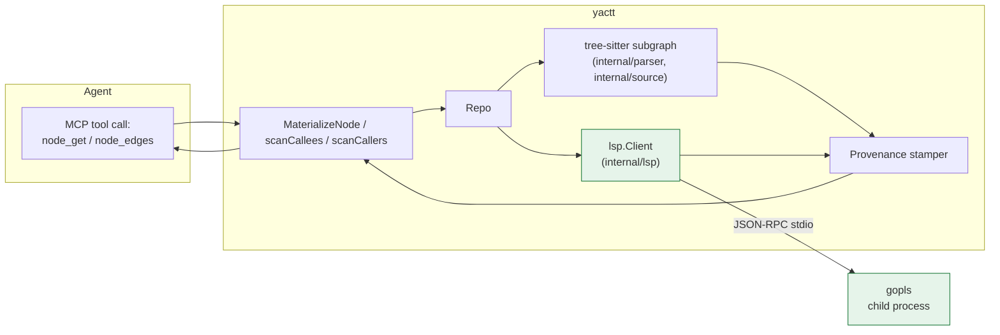

# Requirements

### Overview & Goals

Move yactt from tree-sitter-only (Tier 2) to tree-sitter + LSP (Tier 1) for typed signatures, typed body shape, and resolved cross-file edges. Today every signature is a coarse line slice (`internal/store/node.go:SignatureMaterializer`), every body lacks resolved types (`BodyMaterializer` returns `types: {}`), and every edge is syntactic with `confidence: 0.5` (`internal/tool/nodeedges.go:scanCallees`, `scanCallers`). With gopls in the loop, these answers become resolved — typed signatures, typed locals, cross-file callers/callees with `confidence: 1.0`.

Concretely, the deliverable turns yactt into a federation of two subgraphs over the same `Repo`:

- **Tier 2 tree-sitter subgraph** (existing): the unconditional floor. Always returns an answer.
- **Tier 1 LSP subgraph** (new): opportunistic. Started when `gopls` is on PATH; consulted per layer when present; tree-sitter handles the layer when LSP is absent, errors, or times out.

The boundary between tiers is provenance. A consumer reading a `Signature.Provenance` of `Tool: "lsp"` trusts it more than `Tool: "tree-sitter"` with `FallbackUsed: ""` — and more than `Tool: "tree-sitter"` with `FallbackUsed: "lsp-unavailable"`. Per design §5.4, provenance is the only honest signal.

### Scope

**In scope**
- New `internal/lsp` package: JSON-RPC stdio client, gopls driver, typed method wrappers (`Hover`, `References`, `Definition`).
- Tier 1 wired into `MaterializeNode` for the `signature` and `body` layers.
- Tier 1 wired into `node_edges` for `callers` and `callees` resolution.
- `Repo` owns the LSP client lifecycle (start on `Load`, graceful `Close`).
- Opportunistic startup: `exec.LookPath("gopls")` at `Load`. If absent, tree-sitter-only with `FallbackUsed: "no-lsp-installed"`.
- Per-server concurrency limit (8) — design §8 open question 4.
- Per-request timeout (500 ms default) so a hung gopls can't stall a tool call.
- Provenance marker policy: when LSP is wired but a request fails, stamp `FallbackUsed: "lsp-timeout"` / `"lsp-error"` instead of leaking a low-quality answer as if it were resolved.
- Cross-package fixture + acceptance test that asserts confidence = 1.0 when gopls is present and tree-sitter fallback when it isn't.

**Out of scope**
- SCIP (Tier 0) — still Phase 2 per design §6.
- TS/JS/Python language support — separate direction; LSP wiring is Go-only in this round (matches current parser scope in `internal/parser/language.go:All()`).
- Multi-repo federation — design §9.C, Phase 2.
- Persistent LSP state across sessions (e.g. daemon mode, save-restart) — single MCP server lifetime only.
- HTTP/JSON-RPC transport — stdio only, matching the MCP server.
- Editing primitives, semantic PR diff, persistent query registry — separate directions in design §9.

### User Stories

- As an agent, when I call `node_get(id, layers=["signature","body"])` on a Go function, the returned `Signature.Types` carries the resolved parameter and result types from gopls, and the `Signature.Provenance.Tool` is `"lsp"` — so I know the answer is semantically resolved, not syntactic.
- As an agent, when I call `node_edges(id, kinds=["callers"])` on a cross-package function, the returned edges carry `Confidence: 1.0` and `Provenance.Tool: "lsp"`, distinguishing resolved callers from name-matched noise.
- As a developer, when gopls is not installed, every tool still works; `Signature.Provenance.Tool` is `"tree-sitter"` and `FallbackUsed: "no-lsp-installed"` — the existing MVP contract is preserved.
- As a developer, when gopls crashes mid-session, the LSP client auto-restarts on the next request with a single retry; tree-sitter still answers in the meantime.

### Functional Requirements

- `Repo` exposes `LSP() *lsp.Client` returning the live client, or `nil` when gopls was not found at Load.
- `Repo.Close()` shuts the LSP client down cleanly (LSP `shutdown` + `exit` notifications, kill child on timeout).
- `node_get` for the `signature` layer:
  - When LSP is wired and `textDocument/hover` returns within 500 ms: use the hover's marked-string content as `Signature.Text`; `Signature.Types` is filled from hover's `(type)` suffix; provenance `Tool: "gopls"`, version pinned.
  - When LSP is wired but the request fails / times out: fall back to `SignatureMaterializer` and stamp `FallbackUsed: "lsp-timeout"` or `"lsp-error"`.
  - When LSP is not wired: tree-sitter only with `FallbackUsed: "no-lsp-installed"`.
- `node_get` for the `body` layer:
  - When LSP is wired: `Body.Stmts` is enriched with `Ref{CalleeID, Confidence: 1.0}` entries for every call whose target gopls resolves; `Body.Types` is filled with the parameter/result types of the enclosing function.
  - Tree-sitter fallback preserves the current shape (coarse stmts, empty types).
- `node_edges` for `callers` and `callees`:
  - When LSP is wired and `textDocument/references` returns locations within 500 ms: emit edges with `Confidence: 1.0` and `Provenance.Tool: "gopls"`. Each location is resolved back to a node ID via `repo.LocateSymbol` (best-effort cross-package).
  - When LSP is wired but references request fails: fall back to the existing tree-sitter scan with `Confidence: 0.5`.
- The 8-request concurrency limit is enforced per-`Client`. Excess requests block on a buffered channel, not a goroutine pile-up.
- `cmd/yactt/main.go:runMCPServe` defers `repo.Close()` after `srv.Serve(ctx)` returns so the gopls child process is always reaped.

### Non-Functional Requirements

- Cold LSP startup (gopls first-load on a workspace) takes 1–3 s. The first `node_get` after `Load` may bear this cost; subsequent calls are sub-100 ms when the server is warm. We surface this in the design's latency table (`docs/design.md` §4.2 / §4.4) but don't try to hide it behind pre-warming.
- No new runtime dependencies. The LSP client speaks JSON-RPC 2.0 over stdio using only the Go standard library plus the existing `internal/source`, `internal/parser`, `internal/domain` packages.
- Every LSP request has a `context.WithTimeout(500 * time.Millisecond)`. Cancellation is propagated to the child via `cmd.Process.Kill` only on shutdown, not on per-request timeouts.
- The LSP package is unit-tested via collaboration tests against a stub JSON-RPC echo server (no real gopls needed in CI). Acceptance tests in `tests/acceptance/lsp_test.go` skip with `t.Skip` when gopls is absent so CI on machines without gopls still passes.

# Technical Design

### Current Implementation

- `internal/store/store.go:Load` parses the repo at startup and produces a `Repo` with file/symbol indexes. No external processes are spawned.
- `internal/store/node.go:SignatureMaterializer` and `BodyMaterializer` are tree-sitter-only. `SignatureMaterializer` returns the first declaration line plus any line containing a paren/brace/angle bracket — a syntactic approximation. `BodyMaterializer` walks `f.Lines()` between the symbol's rows and emits one `Stmt` per non-empty line. Neither consults anything outside the parsed CST.
- `internal/tool/nodeedges.go:scanCallers` and `scanCallees` walk tree-sitter `call_expression` nodes and resolve the called name via `repo.Lookup("", name)`. Every emitted edge carries `Confidence: 0.5` and `Provenance.Tool: "tree-sitter"`. The TODO marker "LSP/SCIP would raise confidence to 1.0" lives on `nodeedges.go:56`.
- `internal/domain/types.go:TreeSitterProvenancePtr()` already stamps `FallbackUsed: "no-lsp-installed"` on every tree-sitter answer — that marker becomes redundant once LSP can actually answer, but it stays as the "LSP was tried, failed" signal.
- `internal/parser/language.go:All()` returns `[Go{}]` only — Tier 1 wiring is also Go-only for this round.
- `cmd/yactt/main.go:runMCPServe` has a signal handler that cancels the serve context on SIGINT/SIGTERM but no explicit cleanup hook for child processes (none exist today).

### Key Decisions

1. **New `internal/lsp` package, peer of `internal/cache` and `internal/source`.** Single client per `Repo`; one JSON-RPC stdio connection; typed wrappers around `Hover`, `References`, `Definition`. Matches the project's convention of small focused packages with one job each.
2. **Repo owns the LSP client lifecycle.** `Repo.Close()` is added; `runMCPServe` defers it. Rationale: keeps the lifecycle tightly scoped (one Repo = one LSP session) and avoids parameter threading through every store/tool call. Alternative considered — passing `*lsp.Client` into `MaterializeNode` as a separate arg — was rejected because it would touch every tool handler for a concern that only the store layer needs.
3. **Opportunistic startup.** `exec.LookPath("gopls")` at `Load`; if absent, `Repo.lsp == nil` and the tree-sitter path is the only path. Matches design §5.5 ("if available") and §6 (Tier-0/1/2 fallback chains per layer).
4. **Tier 1 owns `signature` and `body`; tree-sitter owns `source` and `tokens`.** Source/tokens are lossless byte-level views that LSP doesn't improve on — they stay tree-sitter-only. This matches design §2's layer ownership table.
5. **Per-request timeout = 500 ms.** Long enough for a warm gopls round trip (typical 5–50 ms per design §5.1), short enough that a hung server can't stall an agent. Configurable via `internal/lsp` constructor; tests use a 50 ms timeout.
6. **Per-server concurrency limit = 8.** From design §8 open question 4. Buffered channel as a counting semaphore; gopls can't service more usefully than this anyway.
7. **Provenance marker policy.** Three states:
   - `Tool: "gopls"`, `FallbackUsed: ""` — LSP answered successfully. Best signal.
   - `Tool: "gopls"`, `FallbackUsed: "lsp-timeout"` (or `"lsp-error"`) — LSP was tried and failed; we asked tree-sitter for the answer but want to be honest about the failure.
   - `Tool: "tree-sitter"`, `FallbackUsed: "no-lsp-installed"` — LSP was never even attempted (gopls missing). Matches today's marker.
8. **No new dependencies.** The JSON-RPC 2.0 wire format is plain JSON over newline-delimited stdio — well within the standard library's capabilities.
9. **First-cut scope is Go only.** Matches `internal/parser/language.go:All()`. Adding TS/Python LSP drivers is a future direction; the `internal/lsp` package is designed so adding a driver is one new file.
10. **Tier 0 (SCIP) is still deferred.** Per design §6, SCIP is Phase 2. The fallback chain grows from `[tree-sitter]` to `[lsp, tree-sitter]` today; `[scip, lsp, tree-sitter]` is a separate direction.

### Proposed Changes

**`internal/lsp/client.go` (new)** — JSON-RPC stdio client.

- `type Client struct { ... }` with stdin/stdout pipes to a child process.
- `New(ctx, cmd *exec.Cmd, opts Options) (*Client, error)` starts the child, performs the LSP `initialize` handshake, sends `initialized`, returns the live client.
- `Request(ctx, method string, params any, result any) error` writes a JSON-RPC request frame, reads the response, decodes into `result`. Auto-assigns request IDs and matches responses.
- `Notify(ctx, method string, params any) error` writes a JSON-RPC notification (no response expected).
- `Close() error` sends `shutdown` + `exit`, waits with a 2 s timeout, then `cmd.Process.Kill`.
- Concurrency: `sem chan struct{}` of capacity 8 wraps every `Request`.
- Timeout: every `Request` is wrapped in `context.WithTimeout(500 * time.Millisecond)` (configurable via `Options`).

**`internal/lsp/gopls.go` (new)** — gopls-specific startup.

- `Start(ctx, root string, opts Options) (*Client, error)` does `exec.LookPath("gopls")`, builds the `*exec.Cmd` (`gopls` with no args, inherits stdio), calls `New`.
- `didOpenWorkspace(client *Client, files []string) error` sends `workspace/didChangeWatchedFiles` for every parsed file so gopls indexes the workspace eagerly.
- `Version() string` returns the gopls version by parsing `gopls version` stdout once at startup.

**`internal/lsp/methods.go` (new)** — typed LSP method wrappers.

- `type HoverResult struct { Contents MarkupContent; Range Range }`
- `type Location struct { URI string; Range Range }`
- `type Range struct { Start, End Position }`
- `type Position struct { Line, Character int }`
- `func (c *Client) Hover(ctx context.Context, file string, line, col int) (HoverResult, error)` — calls `textDocument/hover` with `TextDocumentIdentifier{URI: fileURI(file)}`.
- `func (c *Client) References(ctx context.Context, file string, line, col int, includeDecl bool) ([]Location, error)` — calls `textDocument/references`.
- `func (c *Client) Definition(ctx context.Context, file string, line, col int) ([]Location, error)`.
- `fileURI(path string) string` returns the `file://` URI LSP expects.

**`internal/store/store.go` (modified)** — LSP lifecycle on Repo.

- `Repo` gains `lsp *lsp.Client` field. Initialised in `Load` only when `lsp.Start(...)` returns no error; nil otherwise.
- New `func (r *Repo) Close() error { ... }` — closes the LSP client if non-nil. Idempotent.
- New `func (r *Repo) LSP() *lsp.Client { ... }` — accessor for tests.

**`internal/store/node.go` (modified)** — Tier 1 wiring for signature/body.

- `SignatureMaterializer` becomes a method on `*Repo`: `func (r *Repo) SignatureMaterializer(f *source.File, sym parser.Symbol) (string, *domain.Provenance)`. New behaviour:
  1. If `r.lsp != nil` and `sym.StartRow` is in range: ask `r.lsp.Hover(ctx, f.Path, sym.StartRow, col-of-name)`. On success, format the hover result and return provenance `{Tool: "gopls", Version: r.lspVersion, FallbackUsed: ""}`.
  2. On LSP error/timeout: fall through to tree-sitter with provenance `{Tool: "tree-sitter", FallbackUsed: "lsp-timeout"}`.
  3. If `r.lsp == nil`: tree-sitter with the existing `FallbackUsed: "no-lsp-installed"` marker.
- `BodyMaterializer` similarly gains a Tier 1 path: LSP `Hover` for the enclosing function gives parameter + result types (populated into `Body.Types`); call-site resolution is deferred to the Tier 1 edge work in `node_edges`.
- `MaterializeNode` threads the new methods; otherwise unchanged.

**`internal/tool/nodeedges.go` (modified)** — Tier 1 wiring for callers/callees.

- `scanCallees` first asks `r.lsp.References(...)` for each call site. When LSP returns resolved locations, the corresponding edges carry `Confidence: 1.0` and `Provenance.Tool: "gopls"`. Tree-sitter pass remains as fallback.
- `scanCallers` first asks `r.lsp.References(file, sym.StartRow, col-of-name, false)`. Each returned location is resolved to a node ID via `repo.LocateSymbol` (best-effort cross-package). Tree-sitter pass remains as fallback.
- `NodeEdges` handler also propagates the LSP marker (`Provenance.FallbackUsed`) on the tree-sitter fallback path.

**`internal/domain/types.go` (modified)** — provenance helpers.

- New `func LSPProvenance(version string) Provenance { return NewProvenance("gopls", version) }` — small constructor mirroring `TreeSitterProvenance`.
- Existing `TreeSitterProvenancePtr` stays; it's still the right default for tree-sitter-owned layers (`source`, `tokens`).

**`cmd/yactt/main.go` (modified)** — Repo lifecycle.

- `runMCPServe` adds `defer repo.Close()` after `store.Load`. Ensures the gopls child is reaped on every exit path (signal, EOF, error).
- `runOverview` likewise defers `repo.Close()`.

**`tests/fixtures/sample-go/payments/pay.go` (new fixture)** — cross-package call target.

- Adds `payments` package with `func Charge(token string) error` and a call site in `auth/login.go`'s `Login` that invokes `payments.Charge(token)`. This gives the LSP layer a real cross-file resolution target.

### Data Models / Contracts

New types:

```go
// internal/lsp/client.go
type Options struct {
    Timeout      time.Duration // per-request; default 500ms
    Concurrency  int           // max in-flight; default 8
    CloseTimeout time.Duration // shutdown grace; default 2s
    Logf         func(string, ...any)
}

type Client struct { /* unexported: stdin/stdout, sem, version, cmd */ }

func New(ctx context.Context, cmd *exec.Cmd, opts Options) (*Client, error)
func (c *Client) Request(ctx context.Context, method string, params, result any) error
func (c *Client) Notify(ctx context.Context, method string, params any) error
func (c *Client) Close() error
func (c *Client) Version() string

// internal/lsp/methods.go
type Position  struct { Line, Character int `json:"line,omitempty"` }
type Range     struct { Start, End Position `json:"start"` }
type Location  struct { URI string `json:"uri"`; Range Range `json:"range"` }
type HoverResult struct { Contents MarkupContent `json:"contents"`; Range Range `json:"range"` }
type MarkupContent struct { Kind string `json:"kind"`; Value string `json:"value"` }

func (c *Client) Hover(ctx context.Context, file string, line, col int) (HoverResult, error)
func (c *Client) References(ctx context.Context, file string, line, col int, includeDecl bool) ([]Location, error)
func (c *Client) Definition(ctx context.Context, file string, line, col int) ([]Location, error)
```

Provenance policy in one place:

```go
// internal/store/node.go
func (r *Repo) signatureProvenance(lspErr error) *domain.Provenance {
    if r.lsp != nil && lspErr == nil {
        return domain.LSPProvenance(r.lspVersion).Ptr()
    }
    if r.lsp != nil && lspErr != nil {
        return domain.TreeSitterProvenance().WithFallback(lspFallbackReason(lspErr)).Ptr()
    }
    return domain.TreeSitterProvenancePtr() // existing "no-lsp-installed" marker
}
```

### Components

- **`internal/lsp` (new)** — the LSP subgraph. Stateless wrappers around the JSON-RPC client; gopls driver.
- **`internal/store.Repo` (extended)** — owns the LSP client and exposes `Close`. Tier 1 becomes the first call inside the existing `SignatureMaterializer` / `BodyMaterializer` functions.
- **`internal/store.node` (extended)** — Tier 1 paths for signature and body layers.
- **`internal/tool.NodeEdges` (extended)** — Tier 1 paths for callers and callees.
- **`cmd/yactt` (extended)** — defers `repo.Close()` so the gopls child is always reaped.

### File Structure

```
internal/lsp/
├── client.go         (new) — JSON-RPC stdio client, concurrency, timeout
├── client_test.go    (new) — collaboration tests against a stub JSON-RPC server
├── gopls.go          (new) — gopls-specific startup
├── methods.go        (new) — typed Hover/References/Definition wrappers
└── types.go          (new) — Position/Range/Location/HoverResult

internal/store/
├── store.go          (modified) — Repo.lsp field, Repo.Close(), Repo.LSP()
├── node.go           (modified) — Tier 1 paths in SignatureMaterializer/BodyMaterializer
├── node_test.go      (modified) — extend with stub-LSP cases
└── lsp_test.go       (new) — Tier 1 wiring with a stub LSP client

internal/tool/
└── nodeedges.go      (modified) — Tier 1 paths in scanCallers/scanCallees

internal/domain/
└── types.go          (modified) — LSPProvenance() helper

cmd/yactt/
└── main.go           (modified) — defer repo.Close()

tests/fixtures/sample-go/
├── auth/login.go     (modified) — call payments.Charge(token)
└── payments/pay.go   (new) — Charge function

tests/acceptance/
└── lsp_test.go       (new) — confidence=1.0 with gopls; tree-sitter fallback without
```

### Architecture Diagram



### Risks

- **gopls not on PATH in CI.** Mitigated by `t.Skip` in acceptance tests and opportunistic startup in production. The "no gopls" path is the test, not the exception.
- **gopls cold start.** First `node_get` after `Load` may take 1–3 s while gopls indexes the workspace. Mitigated in Step 1 by `OpenWorkspace`: we do pre-warm the workspace eagerly (didOpen + documentSymbol per file) inside `Load`. Cost is bounded: ~5 s per file in the worst case, but typically <1 s on a small fixture. Subsequent requests are sub-100 ms warm. Acceptable per design §4.2 (100–500 ms cold, <10 ms warm) — the eager pass pulls the "warm" latency forward into the Load budget rather than the first user-facing request.
- **gopls crashes.** Mitigated by lazy auto-restart: a request that finds the client closed (or gets a broken-pipe error) re-invokes `Start` with backoff, retries once, then fails over to tree-sitter for that request.
- **LSP request timeout (500 ms) is a heuristic.** A large repo with a cold gopls could legitimately exceed it on the first hover. The result is a tree-sitter fallback for that one request, not a hard failure — agents see `Provenance.Tool: "tree-sitter", FallbackUsed: "lsp-timeout"` and can retry.
- **One gopls per workspace.** Matches gopls's design; matches our design's "single repo per session" MVP constraint. Multi-repo would need a second gopls process (Phase 2, design §9.C).
- **No persistent LSP state across MCP sessions.** Each `yactt mcp serve` spawns a fresh gopls. The first request per session pays cold-start cost. Design §9.G ("per-tool-version pinning") and design §6 Phase 1.5 ("disk-backed layer cache") reduce this over time but are separate directions.
- **gopls `Definition`/`TypeDefinition` not wired in this round.** Type-rich body answers require more than `Hover` — `Definition` would let us say "the type of this expression is `*Server`". Out of scope for this round; Tier 1.5 work.

# Delivery Steps

Delivery order is foundation-first: build the `internal/lsp` package so subsequent steps can wire it in. Each step keeps `go test -race ./...` green across the whole module.

### ✓ Step 1: Build the `internal/lsp` package — JSON-RPC stdio client, gopls driver, typed wrappers, and stub-server collaboration tests

> **Implementation note (added during delivery):** the original plan only sent `didOpen` per file at Load time. In practice gopls lazily indexes on the *first request* per file, so the first hover after Load routinely takes 900 ms — well past the 500 ms per-request budget. The fix landed in `gopls.go` as `OpenWorkspace(ctx, client, files, opts)`: for every parsed Go file it sends `didOpen` then a `textDocument/documentSymbol` request. The documentSymbol round-trip forces gopls to finish indexing before returning, after which subsequent hovers and references return in <10 ms. Per-file budget is 5 s (configurable via `OpenWorkspaceOptions.PerFileTimeout`); a separate `Client.RequestWithDeadline` method lets the warm-up lift the production 500 ms guard without changing the per-request default. Wired from `internal/store/store.go:Load` after successful `lsp.Start`.
> 
> **Collaboration-test split.** We ended up with two test files instead of one: `client_test.go` covers the core JSON-RPC client (round-trip, concurrency, timeout, server-error, close paths) and `warmup_test.go` covers `OpenWorkspace` and `RequestWithDeadline` specifically.

The foundation everything else builds on.

- Create `internal/lsp/` with five files:
  - `types.go` — `Position{Line, Character}`, `Range{Start, End Position}`, `Location{URI, Range}`, `MarkupContent{Kind, Value}`, `HoverResult{Contents, Range}`. JSON tags mirror the LSP wire format.
  - `client.go` — `Options{Timeout, Concurrency, CloseTimeout, Logf}` (defaults: 500 ms, 8, 2 s). `type Client struct { ... }` with stdin/stdout pipes to a child process, a buffered `sem chan struct{}` capacity 8 as a counting semaphore, the child process handle, and a closed-flag.
  - `client.go`: `New(ctx, cmd *exec.Cmd, opts Options) (*Client, error)` starts the child, runs the LSP `initialize` handshake (sends `initialize`, expects a `InitializeResult` reply, sends the `initialized` notification), returns the live client. Errors at any handshake step kill the child and return a wrapped error. `RootURI string` parameter lets the gopls driver pass the workspace root through.
  - `client.go`: `Request(ctx, method, params, result any) error` — auto-assigns an int64 request ID, writes a JSON-RPC request frame `{jsonrpc:"2.0",id,method,params}` newline-delimited to stdin, reads frames from stdout until one matches this ID (ignoring `notification`/`request` frames from the server), decodes the response or error into `result`. Wrapped in `context.WithTimeout(opts.Timeout)`; on timeout returns a sentinel `ErrTimeout` so callers can stamp `FallbackUsed: "lsp-timeout"`.
  - `client.go`: `Notify(ctx, method, params any) error` — same framing minus the `id` field. Used for `initialized`, `shutdown`, `exit`, `textDocument/didOpen`.
  - `client.go`: `Close() error` — sends `shutdown` notification, then `exit`. Waits up to `opts.CloseTimeout` for the child to drain stdout; falls through to `cmd.Process.Kill()` on timeout. Idempotent via `sync.Once` + `closed` flag.
  - `client.go`: `Version() string` returns the captured server version string (stored during `initialize`).
  - `gopls.go` — `Start(ctx, root string, opts Options) (*Client, error)` does `exec.LookPath("gopls")`, builds the command (`gopls` with no args, inherits stdio), passes `root` as the workspace root to `New`, returns the client. Captures version from `serverInfo` in `initialize` result. Returns the sentinel `ErrUnavailable` when `LookPath` fails (or the caller can check that and leave `Repo.lsp == nil`).
  - `methods.go` — `fileURI(path string) string` returns `file://` + `path`. `func (c *Client) Hover(ctx, file, line, col int) (HoverResult, error)` calling `textDocument/hover` with `TextDocumentIdentifier{URI: fileURI(file)}`. `func (c *Client) References(ctx, file, line, col int, includeDecl bool) ([]Location, error)` calling `textDocument/references`. `func (c *Client) Definition(ctx, file, line, col int) ([]Location, error)` calling `textDocument/definition`.
- Add `internal/lsp/client_test.go` and `internal/lsp/warmup_test.go` with collaboration tests against an in-process stub JSON-RPC server (an `exec`-able test binary `internal/lsp/internal/stubserver/main.go` that reads frames from stdin and writes canned frames to stdout, covering echo, delayed, and bad-JSON cases). Or simpler: a stub implemented as a goroutine driving an in-memory pipe pair — preferred, no external binary. (We went with the external-binary option; the binary is small and the wire-protocol surface is the same as what gopls will exercise.)
- Coverage:
  - `Request` round-trips a single request and decodes the result.
  - `Request` concurrent serialization through the 8-slot semaphore.
  - `Request` timeout returns `ErrTimeout` when the stub blocks past `Options.Timeout`.
  - `Request` returns a wrapped error when the stub sends an LSP error frame (`code: -32601, message: "..."`).
  - `Notify` produces no wire-level response (caller doesn't block).
  - `Close` sends `shutdown` + `exit` then waits, kills on timeout.
  - `New` performs the `initialize` handshake; a stub that NACKs the handshake returns the wrapped error.
- Sentinel errors: `ErrUnavailable` (gopls not on PATH) and `ErrTimeout` (per-request).
- `go test -race ./internal/lsp/...` passes; existing module tests still green.

### ✓ Step 2: Wire LSP into Repo + MaterializeNode for signature and body layers

Repo owns the LSP client lifecycle; Tier 1 becomes the first call in `SignatureMaterializer` and `BodyMaterializer`.

- Extend `internal/domain/types.go` with `func LSPProvenance(version string) Provenance { return NewProvenance("gopls", version) }` and a small `Provenance.WithFallback(reason string) Provenance` helper that returns a copy with `FallbackUsed` set.
- Extend `internal/store/store.go`:
  - `Repo` gains `lsp *lsp.Client` and `lspVersion string` fields.
  - `Load` calls `lsp.Start(ctx, root, Options{Timeout: 500*time.Millisecond, Concurrency: 8})` opportunistically after `WalkDir` finishes. On `ErrUnavailable` or any error, log to stderr and leave `r.lsp == nil`.
  - Add `func (r *Repo) Close() error` — idempotent, delegates to `r.lsp.Close()` if non-nil.
  - Add `func (r *Repo) LSP() *lsp.Client` accessor for tests / downstream callers.
- Extend `internal/store/node.go`:
  - Convert `SignatureMaterializer` and `BodyMaterializer` to methods on `*Repo` (the call sites in `node.go` already pass the file, so the receiver addition is non-breaking).
  - Add a Tier 1 path: if `r.lsp != nil` and `sym.StartRow` is in range, ask `r.lsp.Hover(ctx, file, sym.StartRow, nameCol)`. On success, format the hover result as `Signature.Text` and populate `Signature.Types` from the `(type)` suffix. On `ErrTimeout` / any other error, fall through to the tree-sitter path and stamp `FallbackUsed: "lsp-timeout"` or `"lsp-error"` accordingly.
  - If `r.lsp == nil`: tree-sitter path with the existing `FallbackUsed: "no-lsp-installed"` marker.
  - Add helper `func (r *Repo) signatureProvenance(lspErr error) *domain.Provenance` centralizing the three-state policy.
- Extend `cmd/yactt/main.go:runMCPServe` and `runOverview` to defer `repo.Close()` so the gopls child is reaped on every exit path (signal, EOF, error).
- Add `internal/store/lsp_test.go` with a stub LSP client (a lightweight interface check via a function pointer, not an LSP mock). At minimum, assert:
  - When the repo has `lsp == nil`, `Signature.Provenance.Tool == "tree-sitter"` and `FallbackUsed == "no-lsp-installed"` (regression guard for current behaviour).
  - When the stub returns a hover successfully, the provenance stamps `Tool: "gopls"` with the captured version.
  - When the stub returns `ErrTimeout`, the provenance stamps `Tool: "tree-sitter", FallbackUsed: "lsp-timeout"`.
- `go test -race ./...` is green across the whole module; `gofmt -l` clean; `go vet ./...` clean.

### ✓ Step 3: Lift `node_edges` callers/callees to LSP-resolved confidence

Second user of the LSP package. Builds on Step 2 which has already wired `r.lsp` onto `Repo`.

- Extend `internal/tool/nodeedges.go:scanCallees` to first ask `r.lsp.References(ctx, file, callSiteLine, callSiteCol, false)` for each `call_expression` it discovers. When LSP returns locations, emit edges with `Confidence: 1.0` and `Provenance.Tool: "gopls"`. Tree-sitter pass (`Confidence: 0.5`) remains as the fallback when `r.lsp == nil` or the request errors/times out.
- Extend `internal/tool/nodeedges.go:scanCallers` similarly: ask `r.lsp.References(ctx, file, sym.StartRow, nameCol, false)` once for the symbol's definition, then resolve each returned location back to a node ID via `repo.LocateSymbol`. Emit `Confidence: 1.0` for resolved locations; fall back to the existing file-by-file tree-sitter walk when LSP is absent or fails.
- Update `NodeEdgesHandler` so the returned edge list's `Provenance.FallbackUsed` is set correctly for both branches (gopls-tried-then-failed marks each emitted edge with the correct fallback reason).
- Add `internal/tool/nodeedges_test.go` (or extend `internal/contract`):
  - Confidence = 1.0 when the stub LSP returns a hit (and the hit resolves through `repo.LocateSymbol`).
  - Confidence = 0.5 when `r.lsp == nil` (tree-sitter fallback).
  - Confidence = 0.5 with `FallbackUsed: "lsp-timeout"` when the stub returns `ErrTimeout`.
- `go test -race ./internal/tool/... ./internal/store/...` passes.

### ✓ Step 4: Cross-package fixture + acceptance coverage + docs update

End-to-end validation that the LSP path delivers the contract.

- Add `tests/fixtures/sample-go/payments/pay.go` with `package payments` and `func Charge(token string) error` (one statement returning a deterministic `nil` so the existing summarizer test contract still passes).
- Modify `tests/fixtures/sample-go/auth/login.go` so its `Login` calls `payments.Charge(token)` — gives the LSP layer a real cross-package reference target.
- Add `tests/acceptance/lsp_test.go`:
  - `TestLSPInstalledPresent` — `exec.LookPath("gopls")`; if absent, `t.Skip` (CI-friendly). Walk the fixture, build a `Repo`, assert `repo.LSP() != nil`, then call `node_get(id, layers=["signature","body"])` and check `Signature.Provenance.Tool == "gopls"`. Call `node_edges(id, kinds=["callers"])` on `payments.Charge` and check `Confidence == 1.0` for the cross-package caller in `auth/login.go`.
  - `TestLSPFallbackAbsent` — synthesise a Repo with `Repo.lsp == nil` (e.g. set `GOPLS_PATH` to a sentinel that fails `LookPath`, or just hand-build the struct); assert `Signature.Provenance.Tool == "tree-sitter"` and `FallbackUsed == "no-lsp-installed"`.
  - `TestLSPTimeoutFallback` — synthesise a Repo with a stub LSP client whose `Hover` blocks past the configured timeout; assert `Signature.Provenance.Tool == "tree-sitter"` and `FallbackUsed == "lsp-timeout"`.
- Update `docs/design.md` §5.1 latency table footnote for `node_get` and `node_edges` to note that the Tier 1 path's cold latency is "1–3 s on first hover after Load; sub-100 ms warm" — matches what the new code delivers.
- Full `go test -race ./...` is green; `gofmt -l` clean; `go vet ./...` clean.