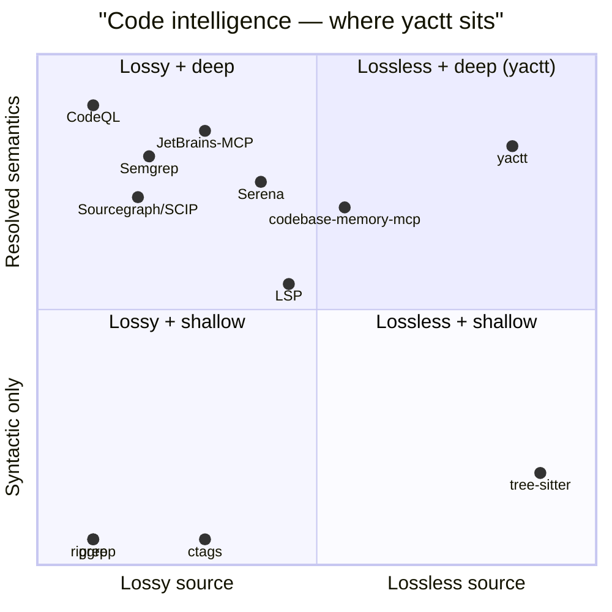

# yactt

**Federated code intelligence for AI agents — lossless source, resolved semantics, MCP-native.**

*Walk the tree, choose your layer.*

`SLSA L3` · `21 tools` · `1 dep` · `read-only`

> **Don't `go install` from `main`.** Release tarballs are SHA256-verified and ship SLSA Build Provenance Level 3 attestations — building from source skips the trust chain. Verify a release:
>
> ```bash
> gh attestation verify yactt_darwin_arm64.tar.gz -R kellenff/yactt
> ```

yactt is a Model Context Protocol server that gives an AI agent both the raw bytes of a source file **and** the resolved symbol/call/reference graph — the empty quadrant of the code-intelligence tradeoff for polyglot Go, TypeScript, JavaScript, and Python repositories. *Yet Another Code Tree Tool*, in the GNU / YACC / WINE tradition; the name is tongue-in-cheek, the tool is serious.

---

## Why yactt

> **Trust, not promises.** Every release binary is signed, checksummed, and SLSA-L3-attested. Verify above; trust the artifact, not the GitHub UI.
>
> **Audit before running.** This tool reads source code at every MCP call. The full source is here. Every response is structured, no write tools exist, and every `tools/call` can be audit-logged with `--audit-log=<file>`.

The reference tools sit on a strict diagonal in the polyglot zone:



yactt occupies the empty corner. It uses [tree-sitter](https://tree-sitter.github.io/) as the unconditional syntactic floor and opportunistically attaches [`gopls`](https://pkg.go.dev/golang.org/x/tools/gopls), [`typescript-language-server`](https://github.com/typescript-language-server/typescript-language-server), and [`pyright-langserver`](https://github.com/microsoft/pyright) for resolved type/call/reference data when those servers are on `PATH`. Without them, yactt still works — every answer is then stamped `provenance.tool = "tree-sitter"` so the agent can branch on what it trusts.

The wire surface is [MCP](https://modelcontextprotocol.org/), not a custom protocol. Every tool declares both an `InputSchema` and an `OutputSchema` (the `OutputSchema` must declare `type:"object"` — enforced at registration time), so an agent gets structured results it can branch on without parsing prose.

---

## Install

> **Don't `go install` from `main`.** The release tarballs are the trust path. Building from source skips the SLSA chain.

Three install paths, organized by who you are.

### For Claude Code users

The bundled plugin installs on first use. The `SessionStart` hook downloads the matched binary from the latest GitHub release, verifies its SHA256 against the published `SHA256SUMS`, and installs to `$XDG_HOME/bin/yactt`. No Go toolchain required.

```bash
/plugin marketplace add kellenff/yactt
/plugin install yactt@yactt
```

Requires `jq` (standard on macOS/Linux developer machines; `brew install jq` / `apt install jq` otherwise). See [plugins/yactt/README.md](plugins/yactt/README.md) for the full install story, including the **SLSA Build Provenance Level 3** attestations verifiable with `gh attestation verify`.

### For Pi agent users

The Pi extension bootstraps yactt on first session and registers it with [pi-mcp-adapter](https://github.com/nicobailon/pi-mcp-adapter). One-liner:

```bash
pi install git:github.com/kellenff/yactt
```

Same trust chain as the Claude plugin — the extension calls the shared `plugins/yactt/scripts/install.sh` to fetch and verify the binary. Restarts pick up any registered MCP server changes; the very first session after install writes the config, the second session onwards the yactt tools are live.

### For Junie users

The Junie extension gives Junie the same 21-tool single-repo surface as the Claude plugin. Because Junie's MCP config has no project-dir variable substitution, a small launcher walks up from `cwd` looking for `.git` and hands the resolved path to `yactt mcp serve`:

```bash
bash plugins/yactt/scripts/install.sh
ln -s "$(pwd)/junie-extension/scripts/yactt-launcher.sh" ~/.local/bin/yactt-launcher
ln -s "$(pwd)/junie-extension" ~/.junie/extensions/yactt
```

Same trust chain as the Claude plugin and Pi extension — the shared `plugins/yactt/scripts/install.sh` does the fetch, SHA-256 verify, and TOFU. See [`junie-extension/README.md`](junie-extension/README.md) for details.

### For AI agent authors

Any MCP-capable client. Wire the server into your `.mcp.json`:

```json
{
  "mcpServers": {
    "yactt": {
      "type": "stdio",
      "command": "yactt",
      "args": ["mcp", "serve", "/path/to/repo"]
    }
  }
}
```

The protocol version is `2024-11-05`. After `initialize` + `notifications/initialized`, call `tools/list` to enumerate the registered tools, then `tools/call` per request.

### For shell pipelines

Download a binary tarball, or build from source:

```bash
# macOS arm64 example
curl -fsSL https://github.com/kellenff/yactt/releases/latest/download/yactt_darwin_arm64.tar.gz \
  | tar -xz -C /usr/local/bin yactt_darwin_arm64 \
  && mv /usr/local/bin/yactt_darwin_arm64 /usr/local/bin/yactt

# then
yactt overview /path/to/repo        # tree dump as JSON
yactt mcp serve                     # MCP server on stdio (registry mode)
```

The CLI is intentionally thin — `help`, `version`, `overview`, `mcp serve`. Anything with logic lives under `internal/`.

The `mcp serve` subcommand runs in **registry mode** — it boots without loading any repo. To work with a repo, an agent first calls `index_repository` with the repo's `file://` URI, then invokes code-intel tools (`tree_overview`, `find_symbol`, etc.) with the same URI in their `project` field. Every targeting tool takes a `file://` absolute-path URI; the legacy positional-path argument on `mcp serve` is removed.

---

## What an agent actually gets from a codebase

Agent prompt:

> *"Where is payment validation handled, and who calls it?"*

```jsonc
// call 1 — find by name. three hits surface the resolution need.
{"tool": "find_symbol", "args": {"name_path": "validatePayment"}}
```
→
```jsonc
{
  "symbols": [
    {"node": {"file": "internal/billing/validator.go",  "line": 14, "kind": "method",   "language": "go"}},
    {"node": {"file": "internal/billing/stripe.go",     "line": 42, "kind": "function", "language": "go"}},
    {"node": {"file": "test/helpers/payment_test.go",   "line":  7, "kind": "function", "language": "go"}}
  ]
}
```

Three hits across two source files and one test file. The agent picks the `validator.go` method.

```jsonc
// call 2 — typed body, LSP-backed. provenance shows which path served the answer.
{"tool": "node_get", "args": {
  "id": "meth:internal/billing/validator.go:validatePayment",
  "layers": ["body"]
}}
```
→
```jsonc
{
  "id":   "meth:internal/billing/validator.go:validatePayment",
  "kind": "method",
  "signature": {"text": "func (v *Validator) validatePayment(ctx context.Context, req *billing.Request) (*billing.Result, error)"},
  "body": {
    "statements": [
      {"kind": "if",     "text": "if err := v.gateway.Authorize(req); err != nil { … }"},
      {"kind": "call",   "text": "return v.capture(req)"},
      {"kind": "return", "text": "return nil, billing.ErrDeclined"}
    ]
  },
  "provenance": {"tool": "gopls", "version": "0.16.2", "fetchedAt": "2026-07-06T13:22:51Z"}
}
```

The method's body, resolved by `gopls`. **This is the resolved-symbol beat — the agent didn't have to grep a second time.**

```jsonc
// call 3 — agent-controllable filtering: just production callers, no tests.
{"tool": "find_referencing_symbols", "args": {
  "symbol": "meth:internal/billing/validator.go:validatePayment",
  "kinds":  ["calls"]
}}
```
→
```jsonc
{
  "references": [
    {"edgeKind": "calls", "targetId": "fn:internal/api/checkout.go:Process",
     "location": {"file": "internal/api/checkout.go", "startLine": 88}},
    {"edgeKind": "calls", "targetId": "fn:cmd/server/main.go:startup",
     "location": {"file": "cmd/server/main.go", "startLine": 31}}
  ],
  "provenance": {"tool": "tree-sitter", "strategy": "syntactic", "confidence": 1.0}
}
```

Two production callers; tests filtered out by `kinds: ["calls"]` (vs `["all"]` which would also return `callees` and `tests`).

```jsonc
// call 4 — what does validatePayment call? flip the direction.
{"tool": "find_referencing_symbols", "args": {
  "symbol": "meth:internal/billing/validator.go:validatePayment",
  "kinds":  ["all"]
}}
```
→
```jsonc
{
  "references": [
    {"edgeKind": "callers", "targetId": "fn:internal/api/checkout.go:Process",  …},
    {"edgeKind": "callers", "targetId": "fn:cmd/server/main.go:startup",        …},
    {"edgeKind": "callees", "targetId": "fn:internal/billing/gateway.go:Authorize", …},
    {"edgeKind": "callees", "targetId": "fn:internal/billing/gateway.go:Capture",   …},
    {"edgeKind": "tests",   "targetId": "fn:test/helpers/payment_test.go:setupPayment", …}
  ]
}
```

```jsonc
// call 5 — the lossless source slice, for human-in-the-loop confirmation.
{"tool": "node_source", "args": {
  "id":    "meth:internal/billing/validator.go:validatePayment",
  "range": [12, 28]
}}
```
→
```jsonc
{
  "text":      "func (v *Validator) validatePayment(ctx context.Context, req *billing.Request) (*billing.Result, error) {\n\treturn v.gateway.Authorize(req)\n}",
  "lines":     {"start": 12, "end": 28},
  "encoding":  "utf-8",
  "provenance": {"tool": "tree-sitter", "version": "0.25.4"}
}
```

Five calls. The agent now has: discovery, typed body with LSP-resolved statements, filtered production callers, the full call surface, and the lossless source. **Call 2 used gopls; calls 1, 3, 4, 5 used tree-sitter with cross-reference resolution against the parsed AST. yactt stamps every response with its provenance so the agent — and you — can tell which path served the answer.**

---

## The 21 tools

The codebase is one node graph; the tools are 21 facets of access.

<details>
<summary><strong>16 code-intelligence tools</strong> (single-repo mode)</summary>

| Tool | Purpose |
|---|---|
| `tree_overview` | Top of the repo tree, depth-limited. Start here. |
| `node_get` | One or more layers of a node — `summary`, `signature`, `body`, `source`, `tokens`. |
| `node_source` | Lossless source for a node, optionally line-bounded. |
| `node_edges` | Cross-references — `callers`, `callees`, `tests`, `overrides`, `imports`. |
| `search` | Find symbols by name or doc-comment matching. |
| `find_symbol` | Locate by qualified name path with glob support (e.g. `internal/store/*/Load`). |
| `get_symbols_overview` | Top-level outline of a single file. |
| `find_code` | AST-aware (tree-sitter) or regex pattern search across files. |
| `search_code` | `find_code` matches collapsed into their containing functions, deduped by symbol, ranked by structural importance (definitions first, popular next, tests last). |
| `find_referencing_symbols` | All references to a given symbol; supports `kinds: ["calls"\|"mentions"\|"tests"\|"overrides"\|"all"]`. |
| `edit_impact` | Analyse the blast radius of a proposed set of renames. **Does not apply them.** |
| `get_graph_schema` | Canonical `nodeKinds`, `edgeKinds`, `layers`. Use to write graph queries without hardcoding. |
| `get_code_snippet` | Source slice for a symbol by stable `id` OR qualified `name_path`. One call replaces `find_symbol` + `node_source`. |
| `get_architecture` | Structural summary: languages, packages, hotspots, dead-code candidates, import cycles. |
| `query_graph` | Multi-hop traversal — chain edge kinds across hops with `follow`, cap with `depth`/`limit`, filter by `kind`. |
| `detect_changes` | Impact of a `git diff` between two refs (or `since` → HEAD). Surfaces changed files + per-file hunks + enclosing function/method per hunk + callers/tests/overrides per affected symbol. |

</details>

<details>
<summary><strong>4 registry tools</strong> (work in both modes)</summary>

| Tool | Purpose |
|---|---|
| `list_projects` | Enumerate every indexed repo (sorted by path). |
| `index_repository` | Walk a repo at `path`, write an entry to the registry, prime its disk cache. |
| `index_status` | Registry row + per-repo cache freshness for `path`. `cacheFresh=false` means re-running `index_repository` would write new bytes. |
| `delete_project` | Evict `path` from the registry and remove its per-repo cache directory. Idempotent. |

</details>

<details>
<summary><strong>1 persisted_query tool</strong></summary>

| Tool | Purpose |
|---|---|
| `persisted_query` | Run a registered curated workflow by id. Out of the box it ships one op: `onboarding` (a one-shot `tree_overview` at depth 2 — the smallest useful workflow). |

</details>

---

## Federated code intelligence

yactt ships a multi-repo registry at `$XDG_CACHE_HOME/yactt/projects.json` (or `$HOME/.cache/yactt/projects.json` when `XDG_CACHE_HOME` is unset). The four registry tools above operate against that file; the 16 code-intelligence tools resolve project URIs on every call (no in-memory repo state).

Two run modes from one binary:

- `yactt mcp serve` — registry mode. Boots without loading any repo; agents pick projects via `index_repository` and pass `file://` URIs to code-intel tools. Exposes all 21 tools (16 code-intel + 4 registry + `persisted_query`). The legacy `mcp serve <path>` form is removed.
- `yactt mcp serve` (no path) — registry mode. Exposes the 4 registry tools + `persisted_query`. Use this to discover or manage which repos are indexed before drilling into one.

Indexing is decoupled from serving: an agent in registry mode can call `index_repository` to prime a repo's cache, then a separate `yactt mcp serve <that-path>` can serve it with warm caches and zero re-parse.

Example flow in registry mode:

```text
> list_projects                          # empty
> index_repository {"path": "/code/svc-a"}
> list_projects                          # one entry
> index_status    {"path": "/code/svc-a"} # cacheFresh: true
> delete_project  {"path": "/code/svc-a"} # gone
```

The on-disk cache layout is unchanged from the single-repo flow — `$XDG_CACHE_HOME/yactt/<root-hash>/` still holds per-file parsed entries, so a registry-indexed repo serves identically to one you ran `yactt mcp serve` against directly.

---

## What's behind the badge row

The trust strip above (`SLSA L3 · 21 tools · 1 dep · read-only`) is four claims. Each one has a receipt:

- **`SLSA L3`** — every release binary is signed and attested. Verify:
  ```bash
  gh attestation verify yactt_darwin_arm64.tar.gz -R kellenff/yactt
  ```
  The attestation payload is `provenance.intoto.jsonl`; its subject digest matches the SHA256 in the published `SHA256SUMS`.

- **`21 tools`** — verified at runtime: `yactt mcp serve /tmp/foo` boots the server, then call `tools/list` against the running stdio to enumerate the 21 registered names. The contract is also pinned by `internal/tool/wire_shape_test.go` (382 lines) — every `InputSchema` and `OutputSchema` is JSON-Schema-validated at registration time.

- **`1 dep`** — `go.mod`, in full:
  ```
  module github.com/kellenff/yactt
  go 1.26.4
  require github.com/smacker/go-tree-sitter v0.0.0-20240827094217-dd81d9e9be82
  ```
  The pseudo-version is a literal commit hash of upstream `smacker/go-tree-sitter`. All four grammar bindings yactt actually loads (`.../golang`, `.../javascript`, `.../typescript/typescript`, `.../python`) are subpackages of the same module and share the commit pin.

- **`read-only`** — the MCP surface exposes no write tools. `edit_impact` analyses renames; it does not apply them. The only paths yactt ever writes to are inside the disk cache directory (`$XDG_CACHE_HOME/yactt/<root-hash>/`) and the registry (`$XDG_CACHE_HOME/yactt/projects.json`). Both are user-scoped and never overlap a target repo. `yactt mcp serve` makes no outbound network calls except to spawn `gopls` / `typescript-language-server` / `pyright-langserver` as child processes.

---

## When yactt is the wrong tool

Honest beats, so you don't have to find them by running into them:

- **You need dataflow / taint analysis across function calls.** yactt's edges are syntactic and resolved-type-level, not value-level. Reach for CodeQL or Semgrep.
- **You need SCIP-style cross-repo queries across N repos.** The registry indexes and serves each repo separately; today there's no shared workspace index that stitches symbols across repo boundaries. Multi-repo query is on the roadmap, not shipped.
- **You need to edit, not just navigate.** yactt is read-only by design. `edit_impact` is the closest tool — it tells you the blast radius of a rename; it does not apply it.

If one of the above is your actual job, yactt is the wrong tool today.

---

## Status & roadmap

Shipped:

- V1, V2.x, V3 subgraph slice, V3 first slice, V3 method-bodies slice
- Phase F (per-repo provenance + edge model)
- Single-source `id.For` + per-receiver keying for call-edges (resolved 2026-07-04)
- Multi-repo registry + 4 MCP tools (Issue #8)
- Multi-hop `query_graph` (Issue #9)
- `detect_changes` git-ref diff impact (Issue #11)
- `search_code` dedup + rank by enclosing symbol
- **Python language support** — tree-sitter `.py` / `.pyi` symbol extraction + `pyright-langserver` LSP bridge
- **PHP language support** — tree-sitter `.php` / `.phtml` / `.phps` symbol extraction (functions, classes, interfaces, traits, enums, methods); LSP bridge is opportunistic and ships when a server is wired up
- SLSA Build Provenance Level 3 attestations on every release

Next:

- Multi-repo / federated query (the "federated" in the tagline awaits)
- Persisted-query step chaining and parameter forwarding
- Consumer-side provenance verification inside the SessionStart bootstrap (today: SHA256 + TOFU; tomorrow: `gh attestation verify`)

---

## Trust & security

yactt reads untrusted source code on every MCP call. Full threat model, install-hook trust chain, and mitigations for the OWASP Agentic Skills Top 10 findings live in [docs/security.md](docs/security.md).

- **AST02 supply chain** — `go mod verify`, no-`replace` grep, `govulncheck`, SHA256SUMS + SLSA L3 attestation on releases. The single external dep is pinned to a commit hash.
- **AST03 over-privileged access** — closed by design: read-only MCP surface, `AllowedRoots` constraint on every path-bearing tool, `MaxFiles` cap (50,000 default). No tracking issue — the surface is constrained at every egress.
- **AST05 doc-comment / identifier-name injection (mitigated — Issue #2)** — gates prose behind an opt-in `docs` layer and sanitizes identifier names at egress.
- **AST09 governance / audit (mitigated — Issue #3)** — one structured JSON startup line on stderr (binary SHA-256, resolved root, MaxFiles cap, grammars, LSP status) + an opt-in `--audit-log=<file>` line per `tools/call` (tool, paths, output bytes, duration), plus a runtime check against the install hook's TOFU record.

The structured layers (`signature`, `body`, `summary`) carry no attacker-authored prose and can be trusted as descriptions of structure. If you point yactt at a repo you do not fully trust, treat the `source`, `tokens`, and `docs` layers as untrusted data.

**Tree-sitter as the unconditional floor.** `yactt mcp serve` works without `gopls`, `typescript-language-server`, or `pyright-langserver` installed; every answer is then stamped `provenance.tool = "tree-sitter"` so an agent can branch on the provenance it trusts.

**Bounded resources.** `MaxFiles` defaults to 50,000; disk cache defaults to 512 MiB (`YACTT_DISK_CACHE_MAX_BYTES`); LSP startup is bounded at 15 s; per-file LSP warm-up at 5 s.

**Opt-in audit log:**

```bash
yactt mcp serve --audit-log=/var/log/yactt/audit.log
```

One JSON line per MCP tool invocation:

```json
{"event":"tool_call","timestamp":"2026-07-06T12:34:56Z","tool":"node_get","input_paths":["/Users/kellen/proj/foo.go"],"output_bytes":1024,"duration_ms":12,"is_error":false}
```

The startup line is always written to stderr (even without `--audit-log`), so a host can cross-check the running binary's SHA-256 against its expected release.

---

## Read more

- Architecture deep dive — [docs/design.md](docs/design.md)
- Security & threat model — [docs/security.md](docs/security.md)
- Performance + fidelity benchmarks — [docs/benchmarks.md](docs/benchmarks.md)
- Claude Code plugin story — [plugins/yactt/README.md](plugins/yactt/README.md)
- Latest release — [github.com/kellenff/yactt/releases/latest](https://github.com/kellenff/yactt/releases/latest)
- `code-explore` skill — [plugins/yactt/skills/code-explore/SKILL.md](plugins/yactt/skills/code-explore/SKILL.md)

---

**Dual-licensed** under [Apache-2.0](LICENSE-APACHE) or [MIT](LICENSE-MIT).