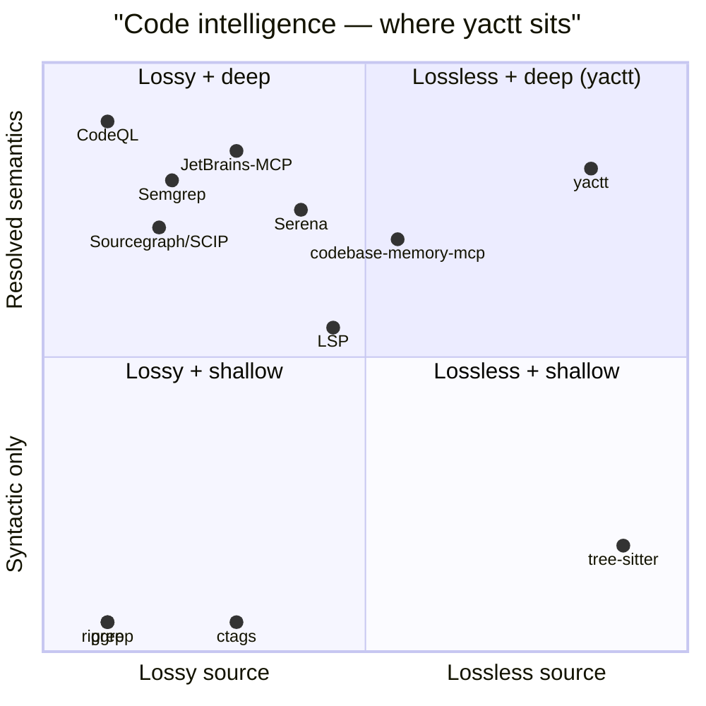
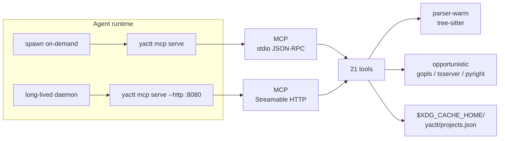

# yactt

**Federated code intelligence for AI agents — lossless source, resolved semantics, MCP-native.**

`SLSA L3` · `21 tools` · `6 languages` · `1 dep` · `read-only`

*Walk the tree, choose your layer.*

> **Don't `go install` from `main`.** Release tarballs are SHA256-verified and ship SLSA Build Provenance Level 3 attestations — building from source skips the trust chain. Verify a release:
>
> ```bash
> gh attestation verify yactt_darwin_arm64.tar.gz -R kellenff/yactt
> ```

yactt is an MCP server that gives an AI agent one parser-warm, URI-addressable view of code written in **Go, TypeScript, JavaScript, Python, PHP, and Rust**. It runs over persistent HTTP, so tree-sitter state survives agent restarts and context-window collapses — a 200k LOC Go monorepo stays parsed across sessions instead of paying 3-8s of reparse latency on every resume. Twenty-one tools, one tree-sitter dependency, read-only filesystem access, SLSA-L3 provenance. Paths are `file://` URIs, so the agent doesn't learn a new addressing dialect. *Yet Another Code Tree Tool*, in the GNU / YACC / WINE tradition; the name is tongue-in-cheek, the tool is serious.

---

## Why yactt

> **Trust, not promises.** Every release binary is signed, checksummed, and SLSA-L3-attested. Verify above; trust the artifact, not the GitHub UI.
>
> **Audit before running.** This tool reads source code at every MCP call. The full source is here. Every response is structured, no write tools exist by default, and every `tools/call` can be audit-logged with `--audit-log=<file>`.

yactt occupies the empty corner of the polyglot code-intelligence tradeoff:



The wire surface is [MCP](https://modelcontextprotocol.org/), not a custom protocol. Every tool declares both an `InputSchema` and an `OutputSchema` (the `OutputSchema` must declare `type:"object"` — enforced at registration time), so an agent gets structured results it can branch on without parsing prose.

yactt uses [tree-sitter](https://tree-sitter.github.io/) as the unconditional syntactic floor and opportunistically attaches [`gopls`](https://pkg.go.dev/golang.org/x/tools/gopls), [`typescript-language-server`](https://github.com/typescript-language-server/typescript-language-server), and [`pyright-langserver`](https://github.com/microsoft/pyright) for resolved type/call/reference data when those servers are on `PATH`. Without them, yactt still works — every answer is then stamped `provenance.tool = "tree-sitter"` so the agent can branch on what it trusts. PHP and Rust rely on tree-sitter alone (LSP availability for those languages is uneven; the trait-irrelevant path is the principled default).

---

## Install

> **Don't `go install` from `main`.** The release tarballs are the trust path. Building from source skips the SLSA chain.

Three install paths, organized by who you are.

### For Claude Code users

The bundled plugin installs on first use. The `SessionStart` hook downloads the matched binary from the latest GitHub release, verifies its SHA256 against the published `SHA256SUMS`, and installs to `$XDG_HOME/bin/yactt`. No Go toolchain required.

```bash
/plugin marketplace add kellenff/yactt
/plugin install yactt@yactt
```

Requires `jq` (standard on macOS/Linux developer machines; `brew install jq` / `apt install jq` otherwise). See [plugins/yactt/README.md](plugins/yactt/README.md) for the full install story, including the **SLSA Build Provenance Level 3** attestations verifiable with `gh attestation verify`.

### For Pi agent users

The Pi extension bootstraps yactt on first session and registers it with [pi-mcp-adapter](https://github.com/nicobailon/pi-mcp-adapter). One-liner:

```bash
pi install git:github.com/kellenff/yactt
```

Same trust chain as the Claude plugin — the extension calls the shared `plugins/yactt/scripts/install.sh` to fetch and verify the binary. Restarts pick up any registered MCP server changes; the very first session after install writes the config, the second session onwards the yactt tools are live.

### For Junie users

The Junie extension gives Junie the same 21-tool single-repo surface as the Claude plugin. Because Junie's MCP config has no project-dir variable substitution, a small launcher walks up from `cwd` looking for `.git` and hands the resolved path to `yactt mcp serve`:

```bash
bash plugins/yactt/scripts/install.sh
ln -s "$(pwd)/junie-extension/scripts/yactt-launcher.sh" ~/.local/bin/yactt-launcher
ln -s "$(pwd)/junie-extension" ~/.junie/extensions/yactt
```

Same trust chain as the Claude plugin and Pi extension — the shared `plugins/yactt/scripts/install.sh` does the fetch, SHA-256 verify, and TOFU. See [`junie-extension/README.md`](junie-extension/README.md) for details.

### For AI agent authors

Any MCP-capable client. Wire the server into your `.mcp.json`:

```json
{
  "mcpServers": {
    "yactt": {
      "type": "stdio",
      "command": "yactt",
      "args": ["mcp", "serve"]
    }
  }
}
```

The protocol version is `2024-11-05`. After `initialize` + `notifications/initialized`, call `tools/list` to enumerate the registered tools, then `tools/call` per request.

For HTTP-capable clients, see **Transports** below.

### For shell pipelines

Download a binary tarball, or build from source:

```bash
# macOS arm64 example
curl -fsSL https://github.com/kellenff/yactt/releases/latest/download/yactt_darwin_arm64.tar.gz \
  | tar -xz -C /usr/local/bin yactt_darwin_arm64 \
  && mv /usr/local/bin/yactt_darwin_arm64 /usr/local/bin/yactt

# then
yactt overview /path/to/repo        # tree dump as JSON
yactt chunk   /path/to/repo        # chunks for RAG ingestion
yactt hybrid  /path/to/repo        # hybrid retrieval
yactt mcp serve                    # MCP server on stdio
```

The CLI is intentionally thin — `help`, `version`, `overview`, `chunk`, `hybrid`, `mcp serve`, `mcp serve --http`. Anything with logic lives under `internal/`.

---

## Transports

yactt ships two transports, sharing the same 21-tool surface. Pick one; the agent's perspective is identical either way.



**stdio (default).** Spawned per agent session; protocol `2024-11-05`. Best for short-lived sessions where reparse latency on startup is negligible (small workspaces). Each session starts cold; tree-sitter re-parses the workspace.

**Persistent HTTP.** Long-running daemon; protocol `2025-03-26` Streamable HTTP. Best for production agents doing 100+ tool calls per session, or any agent that wants to survive across restarts without paying reparse latency. Tree-sitter parse tables stay warm — a 200k LOC Go monorepo doesn't reparse on every agent resume.

```bash
# Boot the daemon — survives agent restarts, context-window collapses
yactt mcp serve --http :8080
# yactt mcp serve listening on 127.0.0.1:8080 protocol=2025-03-26 registry=/Users/you/.cache/yactt/projects.json ...
```

Clients connect to two endpoints:

- `http://127.0.0.1:8080/mcp` — JSON-RPC over POST/GET/DELETE. All 21 tools available; project resolution per-call via `args.project` (a `file://` URI).
- `http://127.0.0.1:8080/healthz` — liveness probe, unauthenticated.

Default bind is `127.0.0.1` with no auth. To expose to a network, pair `--bind=0.0.0.0` with `--auth-token=<secret>`; the daemon refuses non-loopback traffic without a token. TLS termination is the operator's responsibility — front the daemon with Caddy, nginx, or a Cloudflare Tunnel for HTTPS.

**Why this is the architectural anchor.** stdio MCP inherits the lifecycle of the spawning process — every agent restart, every context-window collapse, every MCP-client reinit tears down parser state. HTTP keepalive keeps the parser warm. Incrementality (reparse only changed files, reuse prior symbol tables) is only possible over a persistent transport, which is why this is the prerequisite for the v0.2 roadmap.

---

## URI handling

Every targeting tool takes a `file://` absolute-path URI in its `project` field. The legacy positional-path argument on `mcp serve` is removed (was `yactt mcp serve /abs/path`); the URI goes in the args, on every call.

The server normalizes input so agent variation doesn't break:

| Input | Accepted? | Normalized form |
|---|---|---|
| `file:///abs/path/to/repo` | yes (canonical) | `file:///abs/path/to/repo` |
| `/abs/path/to/repo` (bare absolute) | yes | `file:///abs/path/to/repo` |
| `./relative/to/cwd` | only when cwd is the workspace root | `file://<cwd-absolute>` |
| `file://./relative/foo.py` | no | — (rejected; relative without a base) |
| `file:foo.py` | no | — (rejected; missing `//`) |

Clients should treat the `file://` form returned in tool responses as canonical. Bare paths and relative paths are accepted as ergonomics, not as an addressing dialect — agents that build URIs should emit the canonical form. The bug magnet is mixing the two: tools that build paths from agent output sometimes emit canonical `file://`, sometimes emit bare paths, and a server with sloppy match logic returns two symbols for the same file. yactt's normalizer catches both forms and emits the canonical one back, so the agent's next call sees consistent identity.

---

## What an agent actually gets from a codebase

Agent prompt:

> *"Where is payment validation handled, and who calls it?"*

```jsonc
// call 1 — find by name. three hits surface the resolution need.
{"tool": "find_symbol", "args": {
  "project": "file:///code/svc-billing",
  "name_path": "validatePayment"
}}
```
→
```jsonc
{
  "symbols": [
    {"node": {"file": "internal/billing/validator.go",  "line": 14, "kind": "method",   "language": "go"}},
    {"node": {"file": "internal/billing/stripe.go",     "line": 42, "kind": "function", "language": "go"}},
    {"node": {"file": "test/helpers/payment_test.go",   "line":  7, "kind": "function", "language": "go"}}
  ]
}
```

Three hits across two source files and one test file. The agent picks the `validator.go` method.

```jsonc
// call 2 — typed body, LSP-backed. provenance shows which path served the answer.
{"tool": "node_get", "args": {
  "project": "file:///code/svc-billing",
  "id":      "meth:internal/billing/validator.go:validatePayment",
  "layers":  ["body"]
}}
```
→
```jsonc
{
  "id":   "meth:internal/billing/validator.go:validatePayment",
  "kind": "method",
  "signature": {"text": "func (v *Validator) validatePayment(ctx context.Context, req *billing.Request) (*billing.Result, error)"},
  "body": {
    "statements": [
      {"kind": "if",     "text": "if err := v.gateway.Authorize(req); err != nil { … }"},
      {"kind": "call",   "text": "return v.capture(req)"},
      {"kind": "return", "text": "return nil, billing.ErrDeclined"}
    ]
  },
  "provenance": {"tool": "gopls", "version": "0.16.2", "fetchedAt": "2026-07-13T13:22:51Z"}
}
```

The method's body, resolved by `gopls`. **This is the resolved-symbol beat — the agent didn't have to grep a second time.**

```jsonc
// call 3 — agent-controllable filtering: just production callers, no tests.
{"tool": "find_referencing_symbols", "args": {
  "project": "file:///code/svc-billing",
  "symbol":  "meth:internal/billing/validator.go:validatePayment",
  "kinds":   ["calls"]
}}
```
→
```jsonc
{
  "references": [
    {"edgeKind": "calls", "targetId": "fn:internal/api/checkout.go:Process",
     "location": {"file": "internal/api/checkout.go", "startLine": 88}},
    {"edgeKind": "calls", "targetId": "fn:cmd/server/main.go:startup",
     "location": {"file": "cmd/server/main.go", "startLine": 31}}
  ],
  "provenance": {"tool": "tree-sitter", "strategy": "syntactic", "confidence": 1.0}
}
```

Two production callers; tests filtered out by `kinds: ["calls"]` (vs `["all"]` which would also return `callees` and `tests`).

```jsonc
// call 4 — what does validatePayment call? flip the direction.
{"tool": "find_referencing_symbols", "args": {
  "project": "file:///code/svc-billing",
  "symbol":  "meth:internal/billing/validator.go:validatePayment",
  "kinds":   ["all"]
}}
```
→
```jsonc
{
  "references": [
    {"edgeKind": "callers", "targetId": "fn:internal/api/checkout.go:Process",  …},
    {"edgeKind": "callers", "targetId": "fn:cmd/server/main.go:startup",        …},
    {"edgeKind": "callees", "targetId": "fn:internal/billing/gateway.go:Authorize", …},
    {"edgeKind": "callees", "targetId": "fn:internal/billing/gateway.go:Capture",   …},
    {"edgeKind": "tests",   "targetId": "fn:test/helpers/payment_test.go:setupPayment", …}
  ]
}
```

```jsonc
// call 5 — the lossless source slice, for human-in-the-loop confirmation.
{"tool": "node_source", "args": {
  "project": "file:///code/svc-billing",
  "id":      "meth:internal/billing/validator.go:validatePayment",
  "range":   [12, 28]
}}
```
→
```jsonc
{
  "text":      "func (v *Validator) validatePayment(ctx context.Context, req *billing.Request) (*billing.Result, error) {\n\treturn v.gateway.Authorize(req)\n}",
  "lines":     {"start": 12, "end": 28},
  "encoding":  "utf-8",
  "provenance": {"tool": "tree-sitter", "version": "0.25.4"}
}
```

Five calls. The agent now has: discovery, typed body with LSP-resolved statements, filtered production callers, the full call surface, and the lossless source. **Call 2 used gopls; calls 1, 3, 4, 5 used tree-sitter with cross-reference resolution against the parsed AST. yactt stamps every response with its provenance so the agent — and you — can tell which path served the answer.**

---

## The 21 tools

The codebase is one node graph; the tools are 21 facets of access. Grouped by what they give the agent back.

| Group | What the agent gets |
|---|---|
| **introspect** | Read a file as a structured view: symbols, signatures, source ranges |
| **traverse** | Walk the graph: callers, callees, tests, overrides, imports, multi-hop |
| **search** | Find a symbol or pattern by name, qualified path, regex, or AST |
| **diagnose** | Repo health: dead code, hotspots, import cycles, architecture summary |
| **registry** | Manage which repos are indexed (the file:// URI namespace) |
| **workflow** | Run a curated multi-step op in one call |

### Read-only by design

Of the 21 tools, **19 are read-only**. The two mutating tools are registry cache operations — `index_repository` writes the per-repo cache and `delete_project` evicts it. No tool mutates a target repository, ever.

| Tool | Group | Read-only | Purpose |
|---|---|---|---|
| `tree_overview` | introspect | ✓ | Top of the repo tree, depth-limited. Start here. |
| `node_get` | introspect | ✓ | One or more layers of a node — `summary`, `signature`, `body`, `source`, `tokens`. |
| `node_source` | introspect | ✓ | Lossless source for a node, optionally line-bounded. |
| `get_symbols_overview` | introspect | ✓ | Top-level outline of a single file. |
| `get_code_snippet` | introspect | ✓ | Source slice for a symbol by stable `id` OR qualified `name_path`. One call replaces `find_symbol` + `node_source`. |
| `get_architecture` | introspect | ✓ | Structural summary: languages, packages, hotspots, dead-code candidates, import cycles. |
| `get_graph_schema` | introspect | ✓ | Canonical `nodeKinds`, `edgeKinds`, `layers`. Use to write graph queries without hardcoding. |
| `node_edges` | traverse | ✓ | Cross-references — `callers`, `callees`, `tests`, `overrides`, `imports`. |
| `find_referencing_symbols` | traverse | ✓ | All references to a given symbol; supports `kinds: ["calls"\|"mentions"\|"tests"\|"overrides"\|"all"]`. |
| `query_graph` | traverse | ✓ | Multi-hop traversal — chain edge kinds across hops with `follow`, cap with `depth`/`limit`, filter by `kind`. |
| `edit_impact` | traverse | ✓ | Analyse the blast radius of a proposed set of renames. **Does not apply them.** |
| `detect_changes` | traverse | ✓ | Impact of a `git diff` between two refs (or `since` → HEAD). Per-file hunks + enclosing function/method + callers/tests/overrides per affected symbol. |
| `find_symbol` | search | ✓ | Locate by qualified name path with glob support (e.g. `internal/store/*/Load`). |
| `search` | search | ✓ | Find symbols by name or doc-comment matching. |
| `find_code` | search | ✓ | AST-aware (tree-sitter) or regex pattern search across files. |
| `search_code` | search | ✓ | `find_code` matches collapsed into their containing functions, deduped by symbol, ranked by structural importance (definitions first, popular next, tests last). |
| `persisted_query` | workflow | ✓ | Run a registered curated workflow by id. Ships `onboarding` (a one-shot `tree_overview` at depth 2 — the smallest useful workflow). |
| `list_projects` | registry | ✓ | Enumerate every indexed repo (sorted by path). |
| `index_status` | registry | ✓ | Registry row + per-repo cache freshness for `path`. `cacheFresh=false` means re-running `index_repository` would write new bytes. |
| `index_repository` | registry | ✗ *(cache write)* | Walk a repo at `path`, write an entry to the registry, prime its disk cache. |
| `delete_project` | registry | ✗ *(cache evict)* | Evict `path` from the registry and remove its per-repo cache directory. Idempotent. |

The single source of truth for tool names, descriptions, and schemas is `internal/tool/register.go` — extended by the shared `registerAllTools` helper. The above table is checked at release time against the running binary's `tools/list` output.

---

## When yactt is the wrong tool

Beats, so you don't find them by hitting them.

### yactt vs an LSP-shaped tool (Serena, JetBrains MCP)

yactt trades LSP-grade fidelity for cross-language consistency and parser-warm persistence. **Both bets are defensible. The honest framing:**

| | yactt | LSP-shaped tools (Serena, JetBrains MCP) |
|---|---|---|
| **Response shape** | Parser-shaped (AST-level) | LSP-shaped (IDE semantics) |
| **Fidelity** | Predictable across all 6 languages | Highest for what LSP covers (Go, Python, TypeScript, Java) |
| **Cross-language queries** | Same envelope, same query syntax | Per-language server, per-language quirks |
| **Cold start** | Re-parse (~seconds, one-time per project) | Index build + language server spin-up (per-language) |
| **Persistent state** | HTTP daemon keeps parse tables warm across sessions | Per-session — stdio MCP tears down with the agent |
| **Languages claimed** | 6, all wired, all tested | 40+ via LSP — coverage is wider, depth is variable per LSP |
| **Where it loses** | No type inference, no hover docs, no IDE-grade rename semantics | Wins on Go/Python/TypeScript where LSP is mature |
| **Where it wins** | PHP (LSP story is uneven), 6-lang consistency, persistent state | Single-language deep work in a well-served language |

If your codebase is **single-language and you want hover-docs precision**, use Serena or your editor's LSP-backed MCP. If your codebase is **polyglot, you want predictable tool behavior across all of it, or your agent does 100+ tool calls per session**, use yactt.

### When not yactt

- **You need dataflow / taint analysis across function calls.** yactt's edges are syntactic and resolved-type-level, not value-level. Reach for CodeQL or Semgrep.
- **You need cross-repo queries across N repos.** The registry indexes and serves each repo separately; today there's no shared workspace index that stitches symbols across repo boundaries. Multi-repo query is on the roadmap, not shipped.
- **You need to edit, not just navigate.** yactt is read-only by design. `edit_impact` is the closest tool — it tells you the blast radius of a rename; it does not apply it.
- **Your target language is one we don't ship.** Add a tree-sitter grammar binding (we ship 6 — Go, TS, JS, Python, PHP, Rust — but the pipeline accepts new grammars; `internal/parser` is the integration point).

If one of the above is your actual job, yactt is the wrong tool today.

---

## Federated code intelligence

yactt ships a multi-repo registry at `$XDG_CACHE_HOME/yactt/projects.json` (or `$HOME/.cache/yactt/projects.json` when `XDG_CACHE_HOME` is unset). The four registry tools above operate against that file; the 16 code-intelligence tools resolve project URIs on every call (no in-memory repo state).

Example flow in registry mode:

```text
> list_projects                                       # empty
> index_repository {"path": "file:///code/svc-a"}     # prime cache
> list_projects                                       # one entry
> index_status    {"path": "file:///code/svc-a"}      # cacheFresh: true
> index_repository {"path": "file:///code/svc-b"}     # another repo
> list_projects                                       # two entries
> delete_project  {"path": "file:///code/svc-a"}      # gone
```

The on-disk cache layout is `$XDG_CACHE_HOME/yactt/<root-hash>/` per repo — so a registry-indexed repo serves identically to one you ran `yactt mcp serve` against directly. Cache freshness is per-repo; cross-repo queries are explicitly **not** supported today (see "When yactt is the wrong tool").

---

## What's behind the badge row

The trust strip above (`SLSA L3 · 21 tools · 6 languages · 1 dep · read-only`) is five claims. Each one has a receipt.

- **`SLSA L3`** — every release binary is signed and attested. Verify:
  ```bash
  gh attestation verify yactt_darwin_arm64.tar.gz -R kellenff/yactt
  ```
  The attestation payload is `provenance.intoto.jsonl`; its subject digest matches the SHA256 in the published `SHA256SUMS`. The upcoming SessionStart hook will run this verification at install time (today: SHA256 + TOFU; tomorrow: end-to-end provenance).

- **`21 tools`** — verified at runtime: `yactt mcp serve /tmp/foo` boots the server, then call `tools/list` against the running stdio to enumerate the 21 registered names. The contract is also pinned by `internal/tool/wire_shape_test.go` — every `InputSchema` and `OutputSchema` is JSON-Schema-validated at registration time.

- **`6 languages`** — `internal/parser/language.go:90` returns `[]Language{Go{}, TypeScript{}, JavaScript{}, Python{}, Rust{}, PHP{}}`. All six grammars are bundled in the single tree-sitter dep (subdirectories of `smacker/go-tree-sitter/python`, `.../php`, `.../rust`, `.../golang`, `.../javascript`, `.../typescript/typescript`). Each language has a parsed-symbols test (`internal/parser/parser_test.go:TestDetectPython`, `TestDetectRust`, `TestDetectPHP`, etc.).

- **`1 dep`** — `go.mod`, in full:
  ```
  module github.com/kellenff/yactt
  go 1.26.5
  require github.com/smacker/go-tree-sitter v0.0.0-20240827094217-dd81d9e9be82
  ```
  The pseudo-version is a literal commit hash of upstream `smacker/go-tree-sitter`. All six grammar bindings yactt actually loads are subpackages of the same module and share the commit pin.

- **`read-only`** — the MCP surface exposes no write tools. `edit_impact` analyses renames; it does not apply them. The only paths yactt ever writes to are inside the disk cache directory (`$XDG_CACHE_HOME/yactt/<root-hash>/`) and the registry (`$XDG_CACHE_HOME/yactt/projects.json`). Both are user-scoped and never overlap a target repo. `yactt mcp serve` makes no outbound network calls except to spawn `gopls` / `typescript-language-server` / `pyright-langserver` as child processes.

---

## Status & roadmap

**Shipped:**

- V1, V2.x, V3 subgraph slice, V3 first slice, V3 method-bodies slice
- Phase F (per-repo provenance + edge model)
- Single-source `id.For` + per-receiver keying for call-edges (resolved 2026-07-04)
- Multi-repo registry + 4 MCP tools (Issue #8)
- Multi-hop `query_graph` (Issue #9)
- `detect_changes` git-ref diff impact (Issue #11)
- `search_code` dedup + rank by enclosing symbol
- **Persistent HTTP transport** — `yactt mcp serve --http :PORT` (2025-03-26 Streamable HTTP)
- **file:// URI migration** — every targeting tool takes a `file://` URI in `args.project`
- **6 languages** — Go, TypeScript, JavaScript, Python, PHP, Rust (each with parsed-symbol tests)
- SLSA Build Provenance Level 3 attestations on every release

**Next (visible milestones, in priority order):**

- **Cross-repo graph queries** — the "federated" in the tagline still hasn't been paid out. `query_graph` already supports the multi-hop primitive; extending it across repos is the natural next step.
- **`workspace_overview`** — designed in `docs/design.md § 9.C`. The complement to `tree_overview` once multi-repo queries exist.
- **Persisted-query step chaining** — `persisted_query` becomes the agent's workflow composition primitive. A rename review that goes `detect_changes` → `edit_impact` → render-to-markdown, in one call. (Serena's "composable modes" is the same architectural move; we're already most of the way there.)
- **Consumer-side SLSA attestation verification** — run `gh attestation verify` inside the SessionStart hook. TOFU chain becomes a verified provenance chain.
- **`tree_at(ref)` git-time-travel** — "what did this function look like 3 months ago?" — answers the version-history question without leaving MCP.

---

## Trust & security

yactt reads untrusted source code on every MCP call. Full threat model, install-hook trust chain, and mitigations for the OWASP Agentic Skills Top 10 findings live in [docs/security.md](docs/security.md).

- **AST02 supply chain** — `go mod verify`, no-`replace` grep, SHA256SUMS + SLSA L3 attestation on releases. The single external dep is pinned to a commit hash.
- **AST03 over-privileged access** — closed by design: read-only MCP surface, `AllowedRoots` constraint on every path-bearing tool, `MaxFiles` cap (50,000 default). No tracking issue — the surface is constrained at every egress.
- **AST05 doc-comment / identifier-name injection (mitigated — Issue #2)** — gates prose behind an opt-in `docs` layer and sanitizes identifier names at egress.
- **AST09 governance / audit (mitigated — Issue #3)** — one structured JSON startup line on stderr (binary SHA-256, resolved root, MaxFiles cap, grammars, LSP status) + an opt-in `--audit-log=<file>` line per `tools/call` (tool, paths, output bytes, duration), plus a runtime check against the install hook's TOFU record.

The structured layers (`signature`, `body`, `summary`) carry no attacker-authored prose and can be trusted as descriptions of structure. If you point yactt at a repo you do not fully trust, treat the `source`, `tokens`, and `docs` layers as untrusted data.

**Tree-sitter as the unconditional floor.** `yactt mcp serve` works without `gopls`, `typescript-language-server`, or `pyright-langserver` installed; every answer is then stamped `provenance.tool = "tree-sitter"` so an agent can branch on the provenance it trusts.

**Bounded resources.** `MaxFiles` defaults to 50,000; disk cache defaults to 512 MiB (`YACTT_DISK_CACHE_MAX_BYTES`); LSP startup is bounded at 15 s; per-file LSP warm-up at 5 s.

**Opt-in audit log:**

```bash
yactt mcp serve --audit-log=/var/log/yactt/audit.log
```

One JSON line per MCP tool invocation:

```json
{"event":"tool_call","timestamp":"2026-07-13T12:34:56Z","tool":"node_get","input_paths":["/Users/kellen/proj/foo.go"],"output_bytes":1024,"duration_ms":12,"is_error":false}
```

The startup line is always written to stderr (even without `--audit-log`), so a host can cross-check the running binary's SHA-256 against its expected release.

---

## Read more

- Architecture deep dive — [docs/design.md](docs/design.md)
- Security & threat model — [docs/security.md](docs/security.md)
- Performance + fidelity benchmarks — [docs/benchmarks.md](docs/benchmarks.md)
- Hybrid retrieval shape — [docs/hybrid-retrieval.md](docs/hybrid-retrieval.md)
- Claude Code plugin story — [plugins/yactt/README.md](plugins/yactt/README.md)
- `using-yactt` skill (agent-side workflow guide) — [skills/using-yactt/SKILL.md](skills/using-yactt/SKILL.md)
- `code-explore` skill (agent-side navigation pattern) — [skills/code-explore/SKILL.md](skills/code-explore/SKILL.md)
- Latest release — [github.com/kellenff/yactt/releases/latest](https://github.com/kellenff/yactt/releases/latest)

---

**Dual-licensed** under [Apache-2.0](LICENSE-APACHE) or [MIT](LICENSE-MIT).
