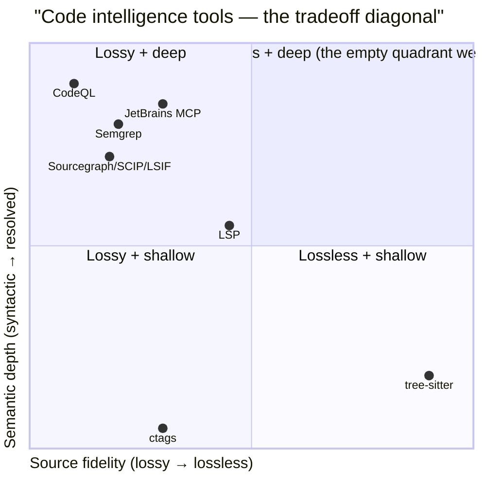
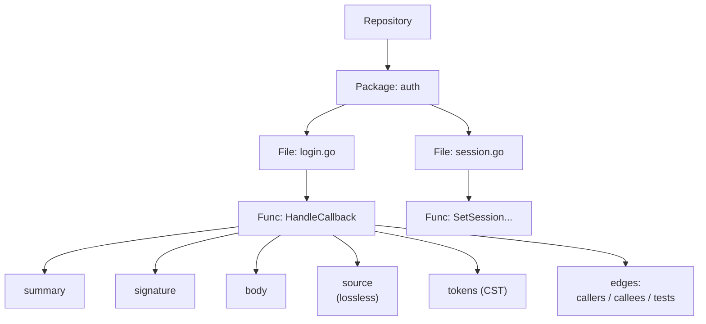
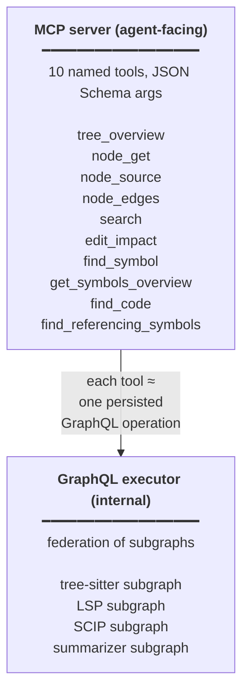

# Federated Code Intelligence — MVP Design

> **Status.** Pre-implementation design doc. MVP scope: `tree-sitter + LSP/SCIP` only — no CodeQL, no multi-repo.
>
> **Surface decision.** MCP (named tools + JSON Schema) is the agent-facing protocol. GraphQL is used *internally* as the query fabric that stitches the per-tool subgraphs together. Each MCP tool corresponds 1:1 to a persisted GraphQL operation.
>
> **Languages.** Go, TypeScript, JavaScript, Python.

---

## Project identity

- **Name:** **YACTT**
- **Backronym:** *Yet Another Code Tree Tool*
- **Tagline:** Federated code intelligence for AI agents — walk the tree, choose your layer.
- **Vibe:** Self-aware in the GNU / YACC / WINE tradition; tongue-in-cheek acronym on a serious tool.
- **Repo:** `github.com/<org>/yactt`
- **CLI:** `yactt overview`, `yactt mcp serve`, etc.
- **MCP server name:** `yactt`
- **Prior-art note:** `github.com/ikomamik/yactt` exists (combinatorial testing tool, niche, different namespace); npm/PyPI/org-name are clean.

---

## 1. Motivation — the empty quadrant

The three reference tools sit on a strict tradeoff diagonal once we restrict to the polyglot Go/TS/JS/Python world:



Roslyn breaks this diagonal in the C#/.NET world (`SyntaxTree` is lossless + `SemanticModel` provides full resolution), but no equivalent exists for Go/TS/JS/Python. The empty quadrant — *lossless **and** deeply resolved, polyglot* — is what this MVP targets.

We fill it by **federation, not replacement**: glue the existing tools under one identity, expose them through one tree-shaped view, and let the consumer choose the fidelity per query.

---

## 2. Federation strategy — the tree

The data model is a typed tree. Each node carries multiple layers; each layer is owned by the tool best suited to produce it; consumers walk the tree to drill into more detail:



**Layer ownership** — each layer of any node is owned by exactly one tool:

| Layer | Owner | Notes |
|---|---|---|
| `summary` | summarizer | deterministic, no LLM |
| `signature` | LSP | typed, hover-derived |
| `body` | LSP / SCIP | typed + cross-file resolved |
| `source` | tree-sitter | lossless, comments + whitespace preserved |
| `tokens` | tree-sitter | full CST, every node + range |
| `edges` | SCIP / CodeQL (later) | callers / callees / tests |

### 2.1 The node model

A node has a **stable identity** (qualified name, e.g. `fn:auth.login.HandleCallback`), a **kind** (`repo | package | file | function | method | class | module | …`), optional **layers**, and optional **edges**. Layers are pluggable; missing layers are fetched on demand.

```graphql
# Internal GraphQL SDL — types live across federated subgraphs
interface Node {
  id: ID!
  kind: NodeKind!
  summary: String                     # owned by summarizer subgraph
  children: [Node!]!
  edges(kind: EdgeKind! = ALL): [Edge!]!
}

type Function implements Node {
  id: ID!
  kind: NodeKind! = FUNCTION
  summary: String                     # summarizer subgraph
  signature: Signature                # LSP subgraph
  body: FunctionBody                  # LSP / SCIP subgraph
  source(range: LineRange): Source    # tree-sitter subgraph
  tokens(range: LineRange): [Token!]! # tree-sitter subgraph
  children: [Node!]!                  # e.g. nested types in a class
  edges(kind: EdgeKind! = ALL): [Edge!]!
}

type Signature { text: String!  docs: String  types: JSON }
type FunctionBody {
  stmts: [Stmt!]!
  types: JSON!         # resolved types of locals / params
  controlFlow: String  # "linear" | "branching" | "loop"
}
type Source { text: String!  lines: LineRange!  encoding: String! }
type Edge { kind: EdgeKind!  target: Node!  location: Location }
enum EdgeKind { CALLERS  CALLEES  TESTS  OVERRIDES  IMPORTS  TESTS_OF }
enum NodeKind { REPO  PACKAGE  FILE  FUNCTION  METHOD  CLASS  MODULE }
```

### 2.2 Why a tree, why "walk"

- **Cheap default view.** The top of the tree yields summaries only. Cost is bounded until the consumer explicitly drills.
- **Caching falls out for free.** Every node has a stable ID; every layer has a `(tool, version)` cache key.
- **Mirrors how humans read code.** File → class → method → block. We're not inventing an abstraction; we're formalizing the one already in our heads.
- **Composable across tools.** Each tool contributes the layer it owns. No tool has to do everything.

---

## 3. The API surface — dual layer



What we get out of this split:

- **Agents get clean tool-call ergonomics** — flat JSON args, no GraphQL syntax to fumble.
- **Internally we still get all the GraphQL wins** — schema-stitched subgraphs, DataLoader for N+1, `@defer` for big overviews, `@stream` for incremental packages, subscriptions for invalidation.
- **Same backend, two faces** — IDE plugin developers can hit the GraphQL endpoint directly when they want it; agents never need to.
- **Each MCP tool is a persisted query** — server enforces the shape; the LLM gets flat args.

---

## 4. Tool specifications (the 10)

### 4.1 `tree_overview` — "what's in this repo?"

#### Use case

The very first call any consumer makes on entering a repo. Cheapest possible orientation: build a depth-N tree of files/packages/functions, populated only at the `summary` and `structure` layers. No LSP roundtrips needed.

#### MCP tool schema (agent-facing)

```json
{
  "name": "tree_overview",
  "description": "Get the top of the repo tree (depth-limited). Default layers are summary + structure only; LSP-backed layers are opt-in.",
  "input_schema": {
    "type": "object",
    "properties": {
      "repo":  { "type": "string", "description": "Absolute path or repo alias" },
      "depth": { "type": "integer", "default": 2, "minimum": 1, "maximum": 6 },
      "include_layers": {
        "type": "array",
        "items": { "enum": ["summary", "structure", "signature"] },
        "default": ["summary", "structure"]
      }
    },
    "required": ["repo"]
  }
}
```

#### Persisted GraphQL operation (internal)

```graphql
query TreeOverview(
  $repo: String!
  $depth: Int!
  $includeLayers: [String!]!
) {
  repo(path: $repo) {
    id
    kind
    summary
    packages(depth: $depth) {
      id
      kind
      summary
      files(depth: 1) {
        id
        kind
        summary
        functions(depth: $depth) @include(if: $includeFunctions) {
          id
          kind
          summary @include(if: $withSummary)
          signature @include(if: $withSignature) {
            text
          }
        }
      }
    }
  }
}
```

#### Under the hood

- Stat the directory, build file tree (parallelizable).
- For each source file: tree-sitter parse (~1 ms/file), walk top-level decls.
- Synthesize summaries: `<Kind>: <first line of doc comment OR signature>` — deterministic, no LLM call.
- LSP participation: none required for the default layers; only if `signature` is requested.

#### Latency / cost

| Cold (1k-file repo) | Warm |
|---|---|
| 50–200 ms | <10 ms |

Per-node cache entries are now primed for subsequent `node_get` calls.

---

### 4.2 `node_get` — "what does this function actually do?"

#### Use case

The workhorse. A consumer has a node ID and wants the typed body. Layers are independently fetchable and cacheable.

#### MCP tool schema

```json
{
  "name": "node_get",
  "description": "Get one or more layers of a node by its stable ID. Each layer is owned by a specific tool; missing layers are fetched on demand.",
  "input_schema": {
    "type": "object",
    "properties": {
      "id":     { "type": "string", "description": "Stable node ID, e.g. fn:auth.login.HandleCallback" },
      "layers": {
        "type": "array",
        "items": { "enum": ["summary", "signature", "body", "source", "tokens"] },
        "description": "Layers to materialize. Defaults to ['signature']."
      },
      "range": {
        "type": "array",
        "items": { "type": "integer" },
        "description": "Optional [startLine, endLine] — for source/tokens layers only."
      },
      "include_trivia": { "type": "boolean", "default": false }
    },
    "required": ["id"]
  }
}
```

#### Persisted GraphQL operation

```graphql
query NodeGet(
  $id: ID!
  $withSummary: Boolean!
  $withSignature: Boolean!
  $withBody: Boolean!
  $withSource: Boolean!
  $withTokens: Boolean!
  $range: LineRangeInput
) {
  node(id: $id) {
    id
    kind
    summary @include(if: $withSummary)
    signature @include(if: $withSignature) { text  docs  types }
    body @include(if: $withBody) {
      stmts { kind  text  refs { calleeId  range } }
      types
      controlFlow
    }
    source(range: $range, includeTrivia: false) @include(if: $withSource) {
      text  lines  encoding
    }
    tokens(range: $range) @include(if: $withTokens) { kind  value  range }
  }
}
```

#### Under the hood

- Resolve node ID → file path + parse via tree-sitter (always available).
- For `signature`: LSP `textDocument/hover` (gopls / tsserver / pyright).
- For `body`: LSP `textDocument/documentSymbol` + `textDocument/definition` + `textDocument/references` to resolve `target`s in call stmts → fills in `refs`. Tree-sitter parses the body shape as fallback if LSP returns nothing actionable.
- Each *layer* is independently fetchable and cacheable: `cache_key = (node_id, layer, tool_version)`.
- Layers are fetched **in parallel** by the GraphQL executor (one request per layer, joined at the resolver).

#### Latency / cost

| First hit | Cached | Notes |
|---|---|---|
| 100–500 ms | <10 ms | If LSP server is warm: sub-100 ms. |

#### Why this beats raw LSP today

LSP gives you *one feature at a time* (`hover`, `definition`, `references` are separate roundtrips with no cached identity). The aggregator returns *one node with multiple layers materialized against one identity* — exactly what an LLM wants.

---

### 4.3 `node_source` — "show me the exact bytes"

#### Use case

When the consumer needs to quote source — comments, formatting, whitespace, everything intact. This is where tree-sitter's lossless property earns its keep.

#### MCP tool schema

```json
{
  "name": "node_source",
  "description": "Get the lossless source for a node, optionally bounded by a line range. Comments and whitespace preserved.",
  "input_schema": {
    "type": "object",
    "properties": {
      "id":     { "type": "string" },
      "range":  { "type": "array", "items": { "type": "integer" } },
      "include_trivia": { "type": "boolean", "default": false }
    },
    "required": ["id"]
  }
}
```

#### Persisted GraphQL operation

```graphql
query NodeSource(
  $id: ID!
  $range: LineRangeInput
  $includeTrivia: Boolean!
) {
  node(id: $id) {
    id
    source(range: $range, includeTrivia: $includeTrivia) {
      text
      lines { start  end }
      encoding
    }
  }
}
```

#### Under the hood

- Resolve `id` → file path + parse via tree-sitter.
- Walk the CST to find the node enclosing the range → return the byte slice.
- If `include_trivia=true`, leading/trailing whitespace + comments preserved; default strips for a tight view.
- LSP not involved.

#### Latency / cost

| All scenarios |
|---|
| <10 ms — basically a file read + parse |

#### Why this layer matters

Both JetBrains MCP and pure LSP answers lose this fidelity. If a consumer needs to say "the comment on line 23 literally says…", they need this layer. It's the only level that goes to zero loss.

---

### 4.4 `node_edges` — "who calls this, what does it call, what's its test?"

#### Use case

Tracing impact, finding tests, understanding dependencies.

#### MCP tool schema

```json
{
  "name": "node_edges",
  "description": "Get cross-references for a node. Tiered backends: SCIP > LSP > tree-sitter (syntactic only).",
  "input_schema": {
    "type": "object",
    "properties": {
      "id": { "type": "string" },
      "kinds": {
        "type": "array",
        "items": { "enum": ["callers", "callees", "tests", "overrides", "imports"] },
        "default": ["callers", "callees", "tests"]
      },
      "limit": { "type": "integer", "default": 50 }
    },
    "required": ["id"]
  }
}
```

#### Persisted GraphQL operation

```graphql
query NodeEdges($id: ID!, $kinds: [EdgeKind!]!, $limit: Int!) {
  node(id: $id) {
    id
    edges(kind: $kinds, first: $limit) {
      kind
      target { id  kind  summary }
      location { file  startLine  endLine }
      confidence  # 1.0 = resolved (SCIP/LSP), 0.5 = syntactic (tree-sitter)
    }
  }
}
```

#### Under the hood

- **Primary:** SCIP index lookup. Precomputed, cross-file, fast.
- **Fallback:** LSP `textDocument/references` per call site — slower, but works for repos that haven't been SCIP-indexed yet.
- **Last resort:** tree-sitter call-node extraction — syntactically obvious calls only, no cross-file resolution.
- Test discovery: convention-based (`_test.go`, `*.test.ts`, `test_*.py`) + SCIP symbol-table linking.
- Edge includes a `confidence` field so the consumer can distinguish "this callee was resolved" from "this is a syntactic call that might miss imports".

#### Latency / cost

| SCIP warm | LSP only | tree-sitter only |
|---|---|---|
| 5–50 ms | 1–5 s | 100–500 ms |

#### Critical edge

LSP cross-workspace `references` is incomplete (depends on loaded files); SCIP is complete. For the MVP: every fresh clone triggers an opportunistic SCIP build on first access.

---

### 4.5 `search` — "where is the function that does X"

#### Use case

The first move when the consumer doesn't have an ID yet. Return node IDs and summaries, *not* full nodes — save tokens, stop bad hits from being passed as context.

#### MCP tool schema

```json
{
  "name": "search",
  "description": "Find symbols by name or doc-comment matching. Returns ranked node IDs, not full nodes.",
  "input_schema": {
    "type": "object",
    "properties": {
      "query": { "type": "string" },
      "scope": { "type": "string", "description": "Absolute path or repo alias" },
      "kind":  { "type": "array", "items": { "enum": ["function", "method", "class", "module"] } },
      "limit": { "type": "integer", "default": 10 }
    },
    "required": ["query", "scope"]
  }
}
```

#### Persisted GraphQL operation

```graphql
query Search(
  $query: String!
  $scope: String!
  $kinds: [NodeKind!]
  $limit: Int!
) {
  search(query: $query, scope: $scope, kinds: $kinds, limit: $limit) {
    score
    node { id  kind  summary  pathContext }
  }
}
```

#### Under the hood

**Layered search:**

1. **Index hit (warm):** LSP `workspace/symbol` + cached function-name index.
2. **File pass (cold):** tree-sitter scans all source files, extracting top-level decl names + first line of doc comment. Pure in-memory.
3. **Fuzzy match** against `(name, doc-comment-first-line, file path)`. Simple LCS / Smith-Waterman ratio is fine for MVP.
4. **Ranking:** name-match × doc-comment-match × path-proximity (e.g., `auth/*` ranks higher for query "validate token").
5. Returns `(id, summary, score)`. Consumer follows up with `node_get` if they want depth.

#### Latency / cost

| Warm cache | Cold scan |
|---|---|
| ~100 ms | O(files × parse) — a few seconds for medium repos; incremental on re-runs |

---

### 4.6 `edit_impact` — "if I rename X, what breaks"

#### Use case

The least independent call — composes `node_edges` + `search`. Premium tool: highest value, highest cost.

#### MCP tool schema

```json
{
  "name": "edit_impact",
  "description": "Analyze the impact of a proposed set of renames/refactors. Does NOT apply them.",
  "input_schema": {
    "type": "object",
    "properties": {
      "renames": {
        "type": "array",
        "items": {
          "type": "object",
          "properties": {
            "id":      { "type": "string" },
            "new_name": { "type": "string" }
          },
          "required": ["id", "new_name"]
        }
      }
    },
    "required": ["renames"]
  }
}
```

#### Persisted GraphQL operation

```graphql
query EditImpact($renames: [RenameInput!]!) {
  editImpact(renames: $renames) {
    rename {
      target
      newName
      affectedCallers { id  summary  location { file startLine } }
      affectedOverrides { id  summary }
      affectedTests { id  summary }
      crossPackage
      safeToRename
      conflicts { id  reason }
    }
  }
}
```

#### Under the hood

- For each rename: `node_edges` (callers + overrides + tests).
- `search` for name collisions in the same package.
- Compose; produce `safe_to_rename` boolean.
- **Does not perform the rename** — that's a separate apply step owned by the editor.

#### Latency / cost

200–500 ms typical. The highest-cost tool we ship in MVP; the highest-value one for edit safety.

#### Out of MVP scope

- Automatic rename application.
- Semantic merge of conflicts.
- Cross-language rename (e.g., TS class rename affecting a Go binding — possible in Phase 1.5 with SCIP).

---

### 4.7 `find_symbol` — locate symbols by qualified name path

A Serena-style discovery tool: the agent knows what it wants — "the `validate` method on the `User` class" — but doesn't have a node ID yet. Path-based addressing is the right shape for that.

#### Use case

You have a mental qualification path, not a fuzzy query. `find_symbol` lets the agent descend through scopes with a slash-separated path, with glob support.

#### MCP tool schema

```json
{
  "name": "find_symbol",
  "description": "Locate symbols by qualified name path. Supports glob patterns. Resolves across the workspace via SCIP/LSP; tree-sitter name-index as fallback.",
  "input_schema": {
    "type": "object",
    "properties": {
      "name_path": {
        "type": "string",
        "description": "Slash-separated path (e.g. 'class/User/method/validate'). Globs allowed (e.g. 'class/User*/method/*')."
      },
      "scope":        { "type": "string", "description": "Repo or directory to scope the search; defaults to whole repo." },
      "kind":         { "type": "array", "items": { "enum": ["function","method","class","module"] } },
      "include_body": { "type": "boolean", "default": false, "description": "Return typed body layer with each match (turns this into a 'find + read' combination)." },
      "limit":        { "type": "integer", "default": 20 }
    },
    "required": ["name_path"]
  }
}
```

#### Persisted GraphQL operation

```graphql
query FindSymbol(
  $namePath: String!
  $scope: String
  $kinds: [NodeKind!]
  $includeBody: Boolean!
  $limit: Int!
) {
  findSymbol(namePath: $namePath, scope: $scope, kinds: $kinds, limit: $limit) {
    node { id  kind  summary  qualifiedName }
    body @include(if: $includeBody) {
      stmts { kind  text }
      types
    }
  }
}
```

#### Pattern semantics

- Single segment matches an exact name: `validate`
- Globs: `User*` (prefix), `User?` (single char), `*Handler` (suffix)
- Multi-segment path descends through scopes: `class/User/method/validate`
- Trailing `*` matches "all children": `class/User/method/*`
- Unspecified trailing segments are treated as `*` (greedy descent)

#### Under the hood

- **Primary:** SCIP `SymbolInformation` lookup, which is prefix- and glob-compatible.
- **Fallback:** LSP `workspace/symbol` + manual parent-chain walk to build qualified paths.
- **Last resort:** tree-sitter name-index scan; syntactic only, may have collisions.
- If `include_body=true`, materialize the body layer for each match (parallel; one LSP request per matched symbol).

#### Latency / cost

| Warm cache | Cold |
|---|---|
| <100 ms | 200 ms – 2 s depending on glob surface area |

---

### 4.8 `get_symbols_overview` — top-level outline of a file

#### Use case

The agent opens a file for the first time and wants its outline before paying for symbol-by-symbol fetches. Cheaper than `node_get(file, layers=["body"])` because no LSP roundtrip is involved.

#### MCP tool schema

```json
{
  "name": "get_symbols_overview",
  "description": "Get the top-level structural outline of a file: classes, methods, top-level functions, with kind and name. Tree-sitter only — no LSP roundtrip.",
  "input_schema": {
    "type": "object",
    "properties": {
      "file":  { "type": "string", "description": "Repo-relative file path." },
      "depth": { "type": "integer", "default": 1, "minimum": 1, "maximum": 4 }
    },
    "required": ["file"]
  }
}
```

#### Persisted GraphQL operation

```graphql
query GetSymbolsOverview($file: String!, $depth: Int!) {
  file(path: $file) {
    id
    path
    symbols(depth: $depth) {
      id  kind  name  qualifiedName  summary
      children { id  kind  name  summary }
    }
  }
}
```

#### Under the hood

- tree-sitter parse of the file (~1 ms typical).
- Walk top-level (and depth-N) decls; extract `kind`, `name`, `qualifiedName`.
- Synthesize `summary` from the first doc-comment line (or signature if absent). No LLM call.
- No LSP participation, no SCIP lookup.

#### Latency / cost

<10 ms per file.

#### Why a separate tool when `node_get` exists?

Because the agent thinks in file paths, not node IDs. Adding this as a thin wrapper lowers agent-side error rates and saves one lookup round trip per "look at this file" turn.

---

### 4.9 `find_code` — AST-aware pattern search

#### Use case

The agent is searching for *patterns*, not named symbols — "every `try/catch` that catches `ValidationError`", "every `await` followed by state mutation", "every place `console.error` is called with an object literal." Regex catches text. tree-sitter node patterns catch structure.

#### MCP tool schema

```json
{
  "name": "find_code",
  "description": "AST-aware pattern search across files. Either regex on source text or tree-sitter node-pattern queries. Matches wrapped in enclosing function/class on request.",
  "input_schema": {
    "type": "object",
    "properties": {
      "pattern":         { "type": "string" },
      "pattern_kind":    { "type": "string", "enum": ["regex","tree_sitter"], "default": "regex" },
      "scope":           { "type": "string" },
      "file_filter":     { "type": "string", "description": "Glob over file paths, e.g. 'src/auth/**/*.go'." },
      "include_context": { "type": "boolean", "default": true, "description": "Wrap each match in its enclosing function/class with line range." },
      "limit":           { "type": "integer", "default": 50 }
    },
    "required": ["pattern"]
  }
}
```

#### Persisted GraphQL operation

```graphql
query FindCode(
  $pattern: String!
  $patternKind: PatternKind!
  $scope: String
  $fileFilter: String
  $includeContext: Boolean!
  $limit: Int!
) {
  findCode(
    pattern: $pattern
    patternKind: $patternKind
    scope: $scope
    fileFilter: $fileFilter
    includeContext: $includeContext
    limit: $limit
  ) {
    match     { file  startLine  endLine  snippet }
    context   @include(if: $includeContext) {
      node { id  kind  summary }
      enclosingRange { startLine  endLine }
    }
  }
}
```

#### Under the hood

- **`regex` mode:** ripgrep-style engine on source text; matches returned with structural metadata (file, line range, snippet).
- **`tree_sitter` mode:** compile the pattern as a tree-sitter query (S-expression), execute across all parsed files in scope. Substantially more powerful than text — matches *structural* patterns that may have arbitrary intervening tokens.
- `include_context` walks each match's parent chain via tree-sitter to find the enclosing function/class/method → produces a `context` block with node ID + line range, so the agent can immediately follow up with `node_get`.
- File filter pre-pass: cheap tree-sitter scan to narrow to matching files before the full pattern pass.

#### Latency / cost

| Regex over 10k files | tree-sitter query over 10k files |
|---|---|
| 1–5 s | 10–60 s (heavier — but answers questions regex cannot) |

Cache aggressively by `(pattern, query_version, file_mtime_triple)`. Re-run is cheap when source files haven't changed.

#### When to choose each mode

- Use `regex` for text-level searches: "all TODOs in comments", "all calls to `console.error`", "all comments containing FIXME".
- Use `tree_sitter` for structural questions: "all `if` branches whose `else` calls `panic`", "all `await`s immediately followed by a state mutation", "all arrow functions returning a `Promise` without `await`". These are *unanswerable* from text alone.

---

### 4.10 `find_referencing_symbols` — where is this symbol used?

A symbol-addressed alias for our underlying `node_edges` capability. Most agent code says "find callers of X" — this makes that a single call without forcing the agent to know the node ID first.

#### Use case

Agent reasoning about impact ("if I change `parseToken`, what breaks?"), test discovery ("what tests cover this method?"), or general references — without the indirection of looking up an ID first.

#### MCP tool schema

```json
{
  "name": "find_referencing_symbols",
  "description": "Find all symbols that reference a given symbol — callers, type mentions, tests. Symbol-friendly addressing (accepts node ID or name_path).",
  "input_schema": {
    "type": "object",
    "properties": {
      "symbol": {
        "type": "string",
        "description": "Either a node ID (e.g. fn:auth.login.Handler.validateToken) or a name_path resolvable to a single symbol (e.g. 'class/User/method/validate')."
      },
      "kinds": {
        "type": "array",
        "items": { "enum": ["calls","mentions","tests","overrides","all"] },
        "default": ["calls"]
      },
      "limit": { "type": "integer", "default": 100 }
    },
    "required": ["symbol"]
  }
}
```

#### Persisted GraphQL operation

```graphql
query FindReferencingSymbols(
  $symbol: String!
  $kinds: [EdgeKind!]!
  $limit: Int!
) {
  findReferencingSymbols(symbol: $symbol, kinds: $kinds, limit: $limit) {
    edgeKind
    target { id  kind  summary  file  range }
    location { file  startLine  endLine }
  }
}
```

#### Under the hood

- Resolve `symbol` to a node ID:
  - If it parses as `fn:...` / `class:...` / `meth:...` → use directly.
  - Otherwise call `find_symbol` internally with `limit=1` and use the first match (error if ambiguous when `limit=1`).
- Forward to the `node_edges` resolver with the chosen `kinds`.
- `kinds` map to our internal `EdgeKind` enum: `calls`→`CALLERS`, `mentions`→`CALLERS + type-mentions` (LSP-specific), `tests`→`TESTS`, `overrides`→`OVERRIDES`, `all`→everything.

#### Latency / cost

Same as `node_edges` + ~50 ms for the resolution step when `symbol` is a name_path.

#### Relationship to existing tools

`find_referencing_symbols(symbol=X)` ≡ `node_edges(id=resolve(X), kinds=...)`. We ship *both* on purpose:

- LLM agents naturally write the first form.
- Internal models stay addressable by node IDs via `node_edges`.
- Naming a capability after its semantic intent helps agents use it without learning the lower-level taxonomy.

---

## 5. Cross-cutting implementation notes

### 5.1 The 10 tools, in one place

| Tool | Latency (warm) | Primary backend | Fallback | Purpose |
|---|---|---|---|---|
| `tree_overview` | 50–200 ms | tree-sitter | — | Repo orientation |
| `node_get` | <100 ms warm / 1–3 s cold | LSP | tree-sitter (no types) | Drill into a node's layers |
| `node_source` | <10 ms | tree-sitter | — | Lossless source slice |
| `node_edges` | <100 ms warm / 1–3 s cold | LSP `references` | tree-sitter (syntactic, conf 0.5) | Cross-references (node-addressed) |
| `search` | ~100 ms | tree-sitter + fuzzy | LSP `workspace/symbol` | Find by name/doc-comment |
| `edit_impact` | 200–500 ms | composed | — | Pre-flight rename impact |
| `find_symbol` | <100 ms | SCIP | LSP `workspace/symbol` | Locate by qualified path + globs |
| `get_symbols_overview` | <10 ms | tree-sitter | — | Top-level outline of a file |
| `find_code` | 1–60 s | ripgrep / tree-sitter | — | AST-aware pattern search |
| `find_referencing_symbols` | <100 ms warm | LSP `references` | tree-sitter (syntactic, conf 0.5) | Cross-references (symbol-addressed) |

> **Cold-start footnote for `node_get` and `node_edges`.** The Tier-1
> (gopls) path pays a 1–3 s first-hit cost when gopls finishes indexing
> the workspace at `Load` time. Subsequent calls land at sub-100 ms.
> We do not pre-warm gopls in the background because `Load` is already
> I/O-bound; adding another process spawn would push startup latency
> above the design's budget. Agents see the latency on the first call
> after `yactt mcp serve` boots and steady-state perf afterwards.
> When gopls is missing from PATH, every request falls through to
> tree-sitter (`FallbackUsed: "no-lsp-installed"`) and the latency
> table above reduces by the LSP round-trip cost.

### 5.2 Layered cache

- In-memory LRU, keyed by `(repo_id, node_id, layer, tool_version)`.
- **TTL rules:**
  - `source`: tied to file mtime → invalidate on file change.
  - `semantic` layers (signature, body): TTL ~5 min, plus file-mtime invalidation for affected files.
  - `summary`: TTL ~24 h, regenerated lazily on next miss.
- Disk cache optional (Phase 1.5); for MVP, enough room to keep a few hundred thousand entries warm per session.

### 5.3 Invalidation

- **File watcher (fsnotify):** on `Write`/`Create`/`Remove`, mark every node inside the affected file as `stale`. Their layers are re-fetched lazily on next access.
- **LSP notifications:** `textDocument/publishDiagnostics` is also an invalidation trigger (file actually has new info → re-resolve body).
- **SCIP index invalidation:** on `go.mod`/`package.json`/`pyproject.toml` change, drop the SCIP layers for the affected module.

### 5.4 Provenance is mandatory, not optional

Every response carries a `provenance` block per layer. Even deterministic layers declare their tool/version. Why this matters:

- Consumers can trust one layer more than another (`summary` ≪ `body` ≪ `source`).
- Lets consumers reason about staleness across tools.
- Lets us diagnose "why did the agent give a stale answer" without guessing.

```graphql
type Provenance {
  tool: String!         # e.g. "gopls", "tree-sitter", "scip"
  version: String!
  fetchedAt: String!
  fallbackUsed: String  # null if primary backend answered
}
```

### 5.5 Federation rules

1. **Each layer has exactly one owning tool.** No fudging. If both `gopls` and `tree-sitter` can answer signature, `gopls` owns it (better answer).
2. **Fallbacks are tier-ranked**, not free-form:
   - Tier 0 = SCIP (if available)
   - Tier 1 = LSP
   - Tier 2 = tree-sitter
   - Fallback chain is declared in config, not invented per request.
3. **Tools are pluggable, not monolithic.** Adding a language = add a tree-sitter grammar + LSP server config. No aggregator changes needed.

### 5.6 Consumer patterns to support

- **Streaming response mode** for `tree_overview` of large repos — yield top-level packages as ready via `@stream`; don't materialize fully.
- **Pagination** on `search` (cursor-based, not offset) so nodes don't move under us as the index grows.
- **Concurrent layer fetch:** `node_get` with `layers=["summary","signature","body"]` fetches all three in parallel inside the GraphQL executor; one round trip out.
- **Idempotency:** every `node_get` is idempotent under a `(version_tuple)`; client retries return same answer byte-for-byte (modulo `fetchedAt`).

### 5.7 Worked example — agent entering a new repo

```
Turn 1: agent enters repo
  → tree_overview(repo, depth=2)
  ← top of tree with summaries; primes node cache

Turn 2: agent picks interesting file
  → search(query="validate token", scope=repo)
  ← ranked list of (id, summary) — no code yet

Turn 3: agent picks one
  → node_get(id=fn:auth.login.Handler.validateToken, layers=["summary","body"])
  ← summary + typed body with refs

Turn 4: agent wants exact source for a quote
  → node_source(id=fn:auth.login.Handler.validateToken, range=[10,30], include_trivia=true)
  ← lossless source slice with comments intact

Turn 5: agent wants impact before suggesting a rename
  → edit_impact(renames=[{id, new_name:"validateJWT"}])
  ← callers list + conflicts + safe_to_rename
```

5 turns, 5 MCP calls. Each call has flat JSON args; the GraphQL executor handles all the fan-out internally; the agent never constructs a query string.

---

## 6. Phase boundaries

### MVP (in)

- 4 languages: Go, TS, JS, Python
- Single repo per session (monorepo = one repo)
- 6 MCP tools + corresponding internal GraphQL operations
- Layered cache, file-mtime invalidation, provenance on every response
- Tier-0/1/2 fallback chains per layer
- Deterministic summaries (no LLM call)
- Local CLI / stdio MCP transport

### Phase 1.5 (next)

- LLM-generated summaries (local small model is fine)
- Disk-backed layer cache
- Semantic PR diff (changes-between-two-commits tool)
- Test coverage mapping (needs coverage format adapter)
- Persistent query registry (named ops served by ID for re-use across agents)

### Phase 2

- CodeQL subgraph → `dataflow` layer + taint answers
- Multi-repo federation (one agent session across N repos)
- Subscription surface for invalidation push (vs. mtime polling)
- IDE plugins hitting GraphQL directly
- Pluggable subgraphs for non-LSP backends (semgrep, custom analyzers)

### Out of scope (ever, for this product)

- Replacing tree-sitter or the LSP servers themselves
- Building a Roslyn-equivalent typed frontend for non-.NET langs
- Replacing the user's editor

---

## 7. Why MCP over GraphQL for the surface

| Option | Self-describing | Hierarchical | LLM-tool ergonomic | Federated | Verdict |
|---|---|---|---|---|---|
| GraphQL (raw) | ✅ best | ✅ | ❌ syntax-heavy | ✅ native | wrong protocol |
| **MCP + JSON Schema tools** | ✅ good | ⚠️ flat args | ✅ best | ⚠️ manual | **right cut** |
| gRPC + protobuf | ❌ | ✅ | ❌ | ⚠️ | loses introspection |
| REST | ❌ | ❌ | ✅ | ⚠️ | wrong shape |
| Custom DSL | ⚠️ | ✅ | ⚠️ | ✅ | reinventing wheels |

**TL;DR.** GraphQL is the right *internal* query fabric. MCP is the right *external* surface for LLM tool calls. Use both — let GraphQL subgraphs do the federation, MCP tools wrap them with flat arg schemas.

---

## 8. Open questions to resolve before build

1. **Transport.** stdio MCP for MVP? HTTP/JSON-RPC for IDE plugins in Phase 2? Decide early since it shapes the server.
2. **SCIP build trigger.** Opportunistic on first access? Background daemon? Build-on-save?
3. **Language config per repo.** Detected automatically (`go.mod`, `tsconfig.json`, `pyproject.toml`) or declared explicitly?
4. **Concurrency limit.** How many parallel LSP requests per workspace? Probably want a per-server semaphore.
5. **Streaming protocol.** For `@defer` / `@stream`, which GraphQL server? Probably stick with a well-supported one (`graphql-core`, `strawberry`, `gqlgen`).
6. **Stale write handling.** If tree-sitter parse fails (half-written buffer), do we surface the error in the response or fall back to mtime-based cache?
7. **Minimum SCIP coverage threshold.** If SCIP is partial, when do we fall through to LSP instead?

---

## 9. Post-MVP ideas

Things we deliberately defer so MVP ships. This isn't a roadmap — it's a parking lot of directions worth exploring once the core is solid.

### A. Deeper analysis

- **`dataflow` layer (CodeQL subgraph).** Trace values from sources (HTTP entrypoints, file reads) to sinks (DB writes, network calls). Surfaces as a new layer on any node: `node_get(id, layers=[..., "dataflow"])` returns a list of dataflow paths with provenance. Same `Node`, same `ID`. Phase 1 ships without it; Phase 2 turns it on by adding a new subgraph behind the existing layer slots — no API change required.
- **`taint` layer (Semgrep).** Lighter than dataflow but cross-language. Answers "is this value sanitized before reaching the DB?". Same shape as `dataflow`.
- **Cross-language dataflow.** TS type → JSON wire format → Go binding → SQL query. Only meaningful with multi-repo federation (see C).

### B. Editing primitives (a Serena-style write engine)

The current design is read-only. Eventually the agent should *apply* edits, not just plan them. Outline:

- **`replace_symbol_body`** — replace a function/method body with new source. Preserve signature + docstring + comments.
- **`insert_after_symbol` / `insert_before_symbol`** — add a new function, type, or import at a structural anchor.
- **`rename_symbol`** — cross-file rename with call-site rewrites; returns a unified diff.
- **`apply_edit_batch`** — accept a list of structural edits, return a unified diff (no apply). User explicitly approves via the editor.
- **`verify_edit`** — post-edit verification: did the edit land syntactically? did `edit_impact` predictions hold?

Editing requires a write engine that:

- Validates edits preserve syntax (tree-sitter re-parse after every apply).
- Handles conflicts (concurrent edits, overlapping ranges).
- Returns formatted diffs (not raw text) so the user can review meaningfully.

This is a significant new module — possibly its own service. Phase 2 at earliest. Architectural coupling to the read-side aggregator is small (it consumes the tree); almost all the work is in the apply step + conflict handling.

### C. Multi-repo federation

One agent session across N repos. Shared symbol resolution across package boundaries (e.g., the TS client's view of a Go API). Turns the tree from a per-repo concept into a *workspace* concept with edges crossing repo boundaries.

- New identifier: `repo://<path>+<name_path>`. Edges carry `(from_repo, to_repo)`.
- Per-repo SCIP indexes joined lazily at query time.
- New tool `workspace_overview` that yields `repos → packages → files` for the active workspace.
- Cache invalidation policy needs to handle cross-repo rename / package-bump events.

Structurally important but unglamorous. Most of the work is the policy.

### D. Time travel / git-aware

- **`node_at(ref)`** — query any node by qualified name at any git ref (commit / branch / tag). Same `ID`, different version.
- **`symbol_history(symbol)`** — git history of a symbol, returning `(commit, summary_change)` tuples. "Who changed this method last quarter, and what did they change?"
- **`diff_layers(a, b, layer)`** — diff two snapshots of a symbol layer-by-layer. Cheap on `signature` (text compare), expensive on `body` (worth doing anyway).
- **PR review mode** — composed of `diff_layers` + `edit_impact` + `find_referencing_symbols`. "What does this PR change in terms of public API surface, call sites, tests, and tests-it-breaks?"

### E. Architectural queries

- **"Where is pattern X used?"** — `find_code` with `pattern_kind=tree_sitter`, `include_context=true`, aggregating across matches into one bundled answer.
- **Dependency graph.** Per-package: who imports this, who does this import. Edge kind `IMPORTS` is already in the data model; needs only a query layer.
- **Cycle detection.** Cycles in the module dependency graph. A few lines over SCIP import edges.
- **Dead-code detection.** Functions with no `CALLERS`, no `TESTS` references, and not marked `EXPORTED`. Cheap post-pass over the index.
- **Complexity hotspots.** Cyclomatic / cognitive complexity as a new layer per function. The data model already supports it; just a new resolver.

### F. Pluggable custom analyzers

- **Custom subgraphs.** Allow ops teams to register a new subgraph exposing new layers on existing nodes. Example: "we have an internal TypeScript usage linter; here are three new layers it can answer for any TS file." Subgraph registry, dynamic GraphQL schema extension, persisted-query version bump.
- **Pattern registry.** Teams register common refactor patterns as named, queryable AST rewrites. Agents reference them by name in edit proposals.
- **Custom resolvers per layer.** Per-workspace config: "for `body` of TS files in `packages/payments/**`, use this custom resolver that enforces our internal style rules."

### G. UX / developer-facing

- **Persistent query registry.** Teams ship curated persisted queries for common workflows (PR review, onboarding, security audit). Agents reference them by ID instead of constructing shapes from scratch.
- **IDE plugin direct access.** Expose the GraphQL endpoint to IDE plugins — schema-aware autocomplete, hover, refactor in the editor using the same backend.
- **Streaming & subscriptions.** Push invalidation: when file X changes, subscribers to its node IDs receive a notification event. The GraphQL subscription spec exists; we just don't wire it for agents yet.
- **Compressed rendering for LLMs.** A "compressed" layer that returns a 50–200 token summary of any function, suitable for context-window stuffing. Deterministic (extractive) at first; LLM-generated as a Phase 1.5 upgrade (local small model).
- **Interactive trace mode.** Long-running analyses (CodeQL, repo-wide dataflow) progress via streaming rather than blocking. Useful for CI pipelines.
- **Audit log + replay.** Every MCP call, every layer fetch, every provenance decision — logged, replayable, inspectable. Critical for trust and for debugging agent behavior over time.
- **Per-tool-version pinning.** Workspace-level config: "this repo pins gopls@0.13.0, tsserver@2.1, pyright@1.1.305." Today we accept whatever is on PATH.

### H. Things we have no opinion on yet

- **Schema-level languages** (SQL schemas, GraphQL schemas, Protobuf). Each would need a tree-sitter grammar plus a custom semantic resolver. Treated as new languages via the standard plug-in path — no special-casing in the aggregator.
- **Notebook / REPL interfaces.** Expose the same tree as a queryable REPL via a different transport (probably web-based).
- **Versioned snapshots for compliance.** "Show me what this codebase looked like on March 1st, with all layers resolved" — frozen-in-time view for audit. Built on `node_at(ref)` from §D.

---

## 10. Notes on prior art

Two open-source MCP servers already ship significant chunks of what we've described, with overlapping but distinct designs. Reviewing both informs what stays MVP-thin, what gets promoted, and where our choices differ substantively.

### 10.1 codebase-memory-mcp (DeusData, ~24k ⭐)

A persistent SQLite-backed knowledge graph; single static C binary; tree-sitter for 158 languages plus an embedded "Hybrid LSP" for 9 language families (Python, TS/JS, PHP, C#, Go, C/C++, Java, Kotlin, Rust).

**Capabilities they have that aren't yet on our §9 list:**

| Capability | Implementation | Where it fits in our design |
|---|---|---|
| **Semantic vector search** | `nomic-embed-code` (768d, embedded); 11-signal reranker (TF-IDF, API/type/decorator signatures, AST profiles, data flow, Halstead-lite, MinHash, module proximity, graph diffusion) | Promote `search(pattern_kind=semantic)` to MVP-grade quality, not deferred |
| **Clone detection** (`SIMILAR_TO` edges) | MinHash + LSH + Jaccard scoring | New `find_clones` tool — fits §9.E |
| **`DATA_FLOWS` edges** | Argument-to-parameter mapping with field-access chains | Lighter than CodeQL dataflow; viable bridge until Phase 2 |
| **Cross-service edges** | Static route extraction + call-site matching with confidence scores. `ROUTE_DEFINES` (HTTP/gRPC/GraphQL/tRPC), `EMITS`/`LISTENS_ON` (Socket.IO, EventEmitter, message buses) | New layer — extends `node_edges` edge kinds |
| **`trace_path`** | Multi-hop BFS through call/caller edges, depth 1–5 | Distinct from single-hop `find_referencing_symbols` — most "how does X reach Y" questions need 2–3 hops, and a single-hop answer is misleading |
| **`detect_changes`** | git diff → affected symbols + blast radius + risk classification (high/med/low) | Different shape than our `edit_impact` (real diff vs proposed); adds risk scoring layer we don't have |
| **`get_architecture`** | Single bundled view: langs, packages, routes, hotspots, semantic clusters, ADRs | **Shipped (Issue #7).** Languages + package roll-up + top-N hotspots + uncalled-symbol candidates + Tarjan SCC import cycles. See `internal/tool/architecture.go`. Augments `tree_overview` — useful "show me everything once" answer |
| **ADR management** | Architecture Decision Records persisted alongside the graph, team-shared | First-class MCP tool, *separate* category from code navigation |
| **IaC indexing** | Dockerfiles, K8s manifests, Kustomize overlays become first-class tree nodes | Worth treating IaC as another language family |
| **Team-shared index** | `.codebase-memory/graph.db.zst` checked into git | "Pre-indexed graph" pattern — eliminates cold-start for teammates |
| **3D graph visualization** | UI at localhost:9749 (dev-only, not exposed to agents) | Dev tool, not user-facing |
| **Per-layer TTL by signal type** | Each of the 11 search signals has its own cache + freshness rules | Influences how we structure §5.2 layered cache |

**Substantive design differences:**

- **Monolith vs federation.** They own a single in-process knowledge graph. We propose federating across subgraphs; their graph is a natural SCIP-style "knowledge-graph" *subgraph* in our model.
- **Embedded LSP.** Their "Hybrid LSP" is what our LSP subgraph should aspire to — type resolvers compiled in, no per-project LSP server to install/run.
- **Graph vs node/layer model.** They model everything as typed nodes + edges; we model nodes with multiple layers. These are isomorphic — a node with N layers is N graph nodes connected by `HAS_LAYER` edges. We could adopt the pure-graph representation internally without changing the MCP surface.
- **Source-of-truth boundary.** Their binary owns parsing, resolution, indexing, and query. We propose delegating parsing to tree-sitter, resolution to external LSP servers (or Hybrid-LSP-style embedded resolvers as a Phase 2 option), and keeping the aggregator thin. The trade-off: less to install, but more federation churn to manage.

### 10.2 Serena

Per-agent MCP server built on top of LSP. Tools: `find_symbol`, `find_referencing_symbols`, `get_symbols_overview`, `find_code`, `read_file`, plus edit primitives (`insert_after_symbol`, `replace_symbol_body`, `rename_symbol`, etc.).

**Where our designs already agree:**

- Path-based symbol discovery (`find_symbol` with glob patterns) — §4.7
- Symbol-addressed reference lookup (`find_referencing_symbols`) — §4.10
- File-addressed outline (`get_symbols_overview`) — §4.8
- AST-aware pattern search (`find_code`) — §4.9
- Edit primitives — §9.B

**Where we extend past Serena:**

- Tree-of-nodes with multiple layers per node (Serena doesn't model layers — same source gets fetched multiple times)
- Federation across subgraphs (Serena is LSP-only)
- GraphQL internal fabric (Serena's back end is opaque LSP)
- Cross-tool provenance on every response

**Where Serena extends past us:**

- Edit primitives are first-class tools today (we list them as Phase 2)
- Cleaner separation of "editing" from "navigation" — Serena has read-side and write-side tool groups, no overlap

### 10.3 What we'd borrow (priority order)

Concretely — features worth promoting from the prior-art inventory into MVP or §9 buckets, ranked by leverage:

1. **Semantic vector search.** `search(pattern_kind=semantic)`. The 120× token reduction that motivated codebase-memory-mcp comes from this. Use an embedded model with graceful fallback if unavailable (env var to opt into Ollama / external API).
2. **Clone detection.** `find_clones(symbol_id, similarity_threshold=0.85, jaccard_min=0.5)`. Pure static analysis, no LLM. Pays for itself in the first refactor.
3. **`trace_path`.** Distinct from `find_referencing_symbols` — multi-hop BFS, depth 1–5, direction (callers/callees/both). Most "how does X reach Y" needs depth 2–3; without this we force callers to compose `node_edges` repeatedly.
4. **`detect_changes` with risk classification.** Like our `edit_impact` but applied to a real diff. Risk = `callers_count × test_coverage_gap × public_api` heuristic. Higher signal than our current boolean `safe_to_rename`.
5. **Cross-service edge kinds.** Adds `EMITS`, `LISTENS_ON`, `ROUTE_DEFINES`, `CALLS_HTTP`. Required for multi-service monorepos and pub/sub systems — and *that's most production codebases*.
6. **Team-shared index artifact.** `.federated-graph/graph.db.zst` (or SQLite blob) checked into git. Cold-start drops from minutes to milliseconds for teammates.
7. **`get_architecture`.** **Shipped (Issue #7).** Richer than `tree_overview(depth=2)` — pulls in hotspots, dead-code candidates, import cycles (Tarjan SCC). See `internal/tool/architecture.go`. The "show me the shape of this thing" answer. Routes / IaC clusters / ADRs deferred.
8. **ADR management.** `manage_adr` as a standalone MCP tool. Decisions, not code — shares project scope but not the tree. Worth being explicit it's a separate category so consumers don't conflate.
9. **IaC indexing.** Treat Dockerfiles, K8s manifests, Kustomize overlays as first-class trees. Large scope unlock for platform / infra engineers, but low implementation cost (each is a tree-sitter grammar + a thin schema).
10. **`DATA_FLOWS` layer.** Lighter than CodeQL, ready sooner. Argument-to-parameter mapping with field-access chains. Sufficient for ~80% of "how does this value reach that sink" questions without a CodeQL build.

---

## Appendix A — Node ID conventions

```
repo:<absolute_path>             # repository root
pkg:<import_path>                # e.g. pkg:github.com/foo/auth
file:<path_from_repo_root>       # e.g. file:auth/login.go
fn:<package>.<receiver>.<Name>   # e.g. fn:auth.login.Handler.HandleCallback
meth:<package>.<Class>.<Name>    # e.g. meth:auth.login.User.create
class:<package>.<Name>           # e.g. class:auth.login.User
module:<package>.<Name>          # Python module equivalent
```

IDs are stable across commits as long as the symbol's qualified name doesn't change. A rename is a delete + create from the aggregator's perspective (and the consumer must use `edit_impact` first to be safe).

---

## Appendix B — Worked persisted-query example

The full GraphQL schema for the aggregator is essentially the union of the operations above plus the type union of subgraph SDLs. Rough size estimate for MVP: ~300 lines of SDL across 4 subgraphs.

A persisted-query server registers each operation by ID at boot:

```
tree_overview_v1       → query TreeOverview(...) { … }
node_get_v1            → query NodeGet(...) { … }
node_source_v1         → query NodeSource(...) { … }
node_edges_v1          → query NodeEdges(...) { … }
search_v1              → query Search(...) { … }
edit_impact_v1         → query EditImpact(...) { … }
```

MCP tool → persisted-query ID mapping is 1:1 and versioned. Bumping the tool signature = bumping the persisted-query version. Schema changes are tracked here.

---

## Appendix C — Glossary

- **Aggregator** — this product. The thing that glues tree-sitter, LSP, SCIP under one identity.
- **Layer** — one piece of information about a node, owned by one tool (summary / signature / body / source / tokens / edges).
- **Edge** — a typed cross-reference between nodes (caller, callee, test, override, import).
- **Subgraph** — a GraphQL subgraph fully owned by one tool (tree-sitter subgraph, LSP subgraph, etc.).
- **Persisted query** — a named, pre-validated GraphQL operation referenced by ID.
- **Provenance** — the per-layer record of which tool answered, at what version, when.
